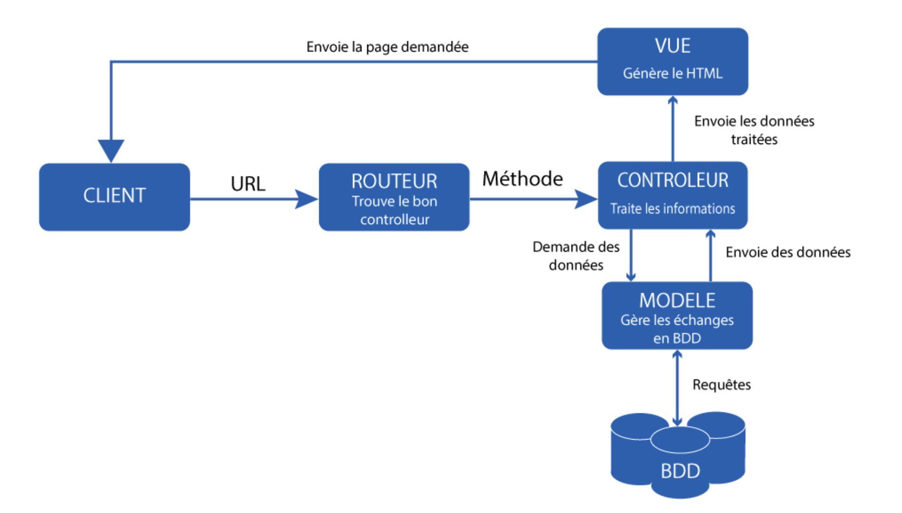

# Php Data le model MVC

Maintenant que vous avez les bases en PHP POO, nous allons pouvoir aborder un sujet très important en PHP et pour le développement d'application web : __le design pattern MVC__ ! 

Avant toute chose, qu'est-ce qu'un design pattern ? C'est ce qu'on appelle un patron de conception, ou en d'autres termes, cela défini une méthode pour procéder à un développement. Plus simplement, c'est un __schéma de construction__ d'application que vous devez suivre.

Il existe plusieurs design pattern en PHP, nous allons nous intéresser de prêt au __MVC__ et légèrement au __singleton__ pour le moment.

Pour informations, le MVC est utilisé par plusieurs frameworks pour application web tels que Symfony, Lavarel, Ruby on Rails, Angulaire Js etc...

Pour le cours, nous allons mettre en place une petite application web qui va ressembler à Indeed, nous allons mettre en avant des annonces de postes.

## MVC définition

MVC est un acronyme pour définir **M**odel **V**ue **C**ontroller, ce design pattern est destiner à scinder votre développement en 3 grands pôles de fichiers/dossiers :

- __Les models__ : 
  - Dans ces fichiers, vous mettrez vos objets (classes), ce sont les fichiers qui représenteront vos tables ainsi que les fichiers qui vont communiquer avec la base de données.
- __Les vues__ :
  - Dans ces fichiers, vous allez mettre toute la partie interface graphique de votre application (vos pages), en HTML avec un peu de PHP pour faire de l'affichage dynamique, mais pas de script.
- __Les controllers__ :
  - Contient la logique concernant les actions à effectuer pour chaque page.

Pour apprendre ce model MVC, nous allons développer ensemble une petite application web qui va reprendre tous les concepts du module MVC.

## La base de données

Avant de se lancer dans notre futur application web, nous allons devoir créer notre base de données et surtout gérer la connexion en base de notre application web à notre BDD.

Pour ça nous allons utiliser le SGBD Mysql ainsi que PHPMyAdmin pour avoir une interface graphique de gestion de nos données.

Vous avez un certains fichiers de configuration Docker pour builder votre environnement avec un serveur PHP, Mysql et PHPMyAdmin, vous avez simplement à builder l'environnement avec la commande `docker-compose up -d`

Vous verrez que dans le dossier app, vous avez déjà 2 fichiers, c'est un autoloader, que nous avons vu lors de la partie introduction, ainsi qu'un fichier index.php qui pour le moment, n'appelle que l'autoloader.

### Le Design pattern Singleton

Pour mettre en place la connexion en BDD, nous allons créer une classe, cette classe aura pour but de gérer la connexion ainsi que les interactions en BDD. Pour cette classe, nous allons utiliser le __design pattern singleton__, ce design pattern à pour but de créer une classe qui n'aura qu'une seule instance, c'est à dire qu'on ne pourra pas créer de 2ème instance de cette classe.

Créez un dossier Db dans lequel vous allez créer un fichier Db.php, ce sera notre classe Db.

Dans ce fichier, nous allons utiliser __PDO__ pour la connexion en base de données (n'oubliez pas la définition du namespace de notre classe ainsi que les uses) :

```php
<?php

namespace App\Db;

// On importe PDO
use PDO;
// On import les exceptions PDO
use PDOException;

class Db extends PDO
{
}
```

Maintenant, nous allons devoir suivre le design pattern singleton en rendant notre classe "unique", nous allons créer une première propriété qui sera en privée et static, cette propriété sera notre seule et unique instance de la classe Db.

Ensuite, nous allons devoir stocker les informations de connexion à la base de données, pour les stocker, nous allons utiliser des constantes privées :

```php
 // Instance unique de la classe
private static $instance;

// Information de connexion en BDD
private const DBHOST = 'db_php_POO_MVC';
private const DBUSER = 'root';
private const DBPASS = 'root';
private const DBNAME = "demo_mvc";
```

À partir de maintenant, nous avons toutes les informations de connexion à notre base de données, nous pouvons commencer à créer notre constructeur, il va avoir comme informations le dsn *(data Source Name ou grossièrement, l'url de notre base de données)* de connexion, ainsi qu'appeler le constructeur de la classe PDO, rappelez vous que nous avons étendu de la classe PDO, donc on appelle le constructeur de la classe PDO en lui passant les informations de connexion en base :

__Rappel__, quand on utilise PDO, le mieux est de créer une structure avec un try pour gérer les potentielles erreur de connexion en BDD, donc nous allons avoir la structure suivante :

```php
public function __construct()
{
  // DSN de connexion
  $dsn = 'mysql:dbname=' . self::DBNAME . ';host=' . self::DBHOST;

  // On appelle le constructeur de la classe PDO
  try {
    parent::__construct($dsn, self::DBUSER, self::DBPASS);
  } catch (PDOException $e) {
    die($e->getMessage());
  }
}
```

Ici, nous venons de faire notre structure de connexion en Base de données avec un Try, maintenant, nous allons définir les paramètres PDO :

```php
public function __construct()
{
  // DSN de connexion
  $dsn = 'mysql:dbname=' . self::DBNAME . ';host=' . self::DBHOST;

  // On appelle le constructeur de la classe PDO
  try {
    parent::__construct($dsn, self::DBUSER, self::DBPASS);
    
    // Définition des paramètres PDO
    $this->setAttribute(PDO::MYSQL_ATTR_INIT_COMMAND, 'SET NAMES utf8');
    $this->setAttribute(PDO::ATTR_DEFAULT_FETCH_MODE, PDO::FETCH_ASSOC);
    $this->setAttribute(PDO::ATTR_ERRMODE, PDO::ERRMODE_EXCEPTION);
    
  } catch (PDOException $e) {
    die($e->getMessage());
  }
}
```

Nous venons de finaliser le constructeur, mais pour le moment, toutes les propriétés ainsi que le constructeur sont en privé, donc inaccessible depuis l'extérieur de la classe, c'est le principe du design pattern singleton.

Pour palier ce problème (nous voulons quand même avoir le droit d'utiliser 1 instance à l'extérieur de la classe), nous allons définir une méthode public qui va vérifier si une instance existe, si oui on la retourne sinon, on la crée.

Cette manière de faire les choses va permettre de ne pouvoir avoir qu'une seule instance de cette classe.

```php
/**
* Vérifie si une instance est crée, sinon la crée et retourne une instance
*
* @return self
*/
public static function getInstance(): self
{
  if (self::$instance === null) {
    self::$instance = new self();
  }

  return self::$instance;
}
```

Bien, maintenant faisons le point sur ce que nous venons de faire sur la classe Db :

- Nous avons étendu de la classe PDO pour gérer la connexion en BDD
- Création de propriété privé instance
- Création des constantes (privées) avec les informations de connexion
- Création du constructeur de la classe : 
  - On crée le DSN avec l'url de la base de données
  - On appelle le constructeur de la classe PDO et on lui passe toutes les informations
  - On définit les paramètres de PDO
  - On vérifie s'il y a des erreurs
- Création de la méthode pour récupérer notre instance de la classe Db

Maintenant, pout utiliser notre instance à l'extérieur de notre classe, nous aurons simplement à faire `Db::getInstance()`

## Le Model

Nous allons maintenant créer un model, qui va stocker toutes les méthodes qui vont nous permettre de manipuler les données.

### Le CRUD

__CRUD__ pour __C__reate __R__ead __U__pdate __D__elete, en d'autres termes, pouvoir lire, modifier, ajouter et supprimer des informations en base de données.

Pour débuter l'architecture MVC, nous allons commencer par créer un dossier Models qui contiendra tous les fichiers qui concernant les model de notre application.

Dans ce dossier, nous allons créer un fichier Model.php, qui va contenir toutes les méthodes de notre CRUD afin de pouvoir gérer les interactions sur nos futures tables.

Pour une vue d'ensemble, cette classe Model sera la classe principale qui sera étendu par toutes nos futures classes tables. Cela nous évite de devoir intégrer les méthodes CRUD dans chacune des classes tables.

Avant toutes choses, notre nouvelle classe Model, va devoir étendre de Db (notre connexion en base de données) :

```php
<?php

namespace App\Models;

use App\Db\Db;

class Model extends Db
{  
}
```

Pour cette classe, nous avons besoin de 2 propriétés :

- Une qui va stocker la future table (qu'on donnera dans les classes enfants)
- Une qui va stocker l'instance de Db

```php
class Model extends Db
{
    // Table de la base de données
    protected $table;

    // Instance de Db
    private $db;    
}
```

Une fois qu'on a ces infos, nous allons devoir créer une méthode principale qui va exécuter une requête préparée ou non en fonction du cas qui sera envoyé par la suite (prepare, execute etc..), c'est tout simplement pour gérer le cas où on a une requête simple (sans valeur extérieur), ou le cas on ajoute des valeurs à la requête.

En d'autres termes, nous allons créer une méthode qui va vérifier si elle doit préparer ou pas la requête.

Cette méthode aura comme paramètre la requêtes SQL, et si besoin un tableau d'options :

```php
public function runQuery(string $sql, ?array $attributs = []): PDOStatement|bool
{
}
```

Ensuite on va récupérer ou instancier l'instance de Db :

```php
public function runQuery(string $sql, ?array $attributs = []): PDOStatement|bool
{
  // On récupère l'instance Db
  $this->db = Db::getInstance();
}
```

Ensuite, nous allons vérifier si nous avons des attributs, si oui, c'est que nous sommes dans le cadre d'une requête préparée, sinon, c'est une requête simple :

````php
public function runQuery(string $sql, ?array $attributs = null): PDOStatement|bool
{
  // On récupère ou instancie Db
  $this->db = Db::getInstance();

  // On vérifie si on a des attributs
  if ($attributs != null) {
    // Requête préparée
  } else {
    // Requête simple
  }
}
````

Maintenant, on va écrire la méthode de requête préparée :

```php
// On vérifie si on a des attributs
if ($attributs != null) {
  // Requête préparée
  $query = $this->db->prepare($sql);
  $query->execute($attributs);
  return $query;
} else {
  // Requête simple
}
```

Enfin, on gère le cas où c'est une requête simple :

```php
// On vérifie si on a des attributs
if ($attributs != null) {
  // Requête préparée
  $query = $this->db->prepare($sql);
  $query->execute($attributs);
  return $query;
} else {
  // Requête simple
  return $this->db->query($sql);
}
```

Maintenant, nous avons notre méthode qui va exécuter nos requêtes en fonction des paramètres que l'on va lui envoyer.

Nous pouvons maintenant commencer le CRUD.

Laissez la méthode runQuery() tout en base de la classe, et sous les propriétés, nous allons ajouter les méthodes.

Dans un premier temps, nous allons créer la méthode pour lire les données (Read).

Cette méthode va nous permettre de récupérer toutes les entrées d'une table, nous allons l'appeler `findAll()`.

Dans cette méthode, nous allons utiliser la méthode runQuery et lui passer la requête SQL :

```php
public function findAll(): array
{
  $query = $this->runQuery('SELECT * FROM' . $this->table);
  return $query->fetchAll();
}
```

Ici nous avons envoyé en requête `SELECT * FROM table` table sera remplacé par la suite dans les classes enfants.


## Les classes Tables

Avant de finir notre CRUD sur la classe Model, afin que vous compreniez bien comment va fonctionner notre Model ainsi que toutes les classes Tables.

Pour ceux qui n'aurez pas suivi, pour chaque table de notre bdd, nous allons avoir une classe qui va étendre de notre Model.

Avant toutes chose, vérifiez si vous avez une table `poste` dans votre bdd, pour ça, rendez vous sur l'url `localhost:8080`, username `root`, mot de passe `root`.

Si vous avez la table, tout est bon, sinon vous devez la créer avec les champs suivants :

- Id 
- titre
- description
- createdAt
- actif

Une fois votre table crée, il va falloir créer la classe PosteModel en PHP qui va représenté notre table dans notre application PHP. Cette classe doit étendre de la classe Model :

```php
<?php

namespace App\Models;

class PosteModel extends Model
{
}
```

Dans un premier temps, on va créer le constructeur de la classe dans le lequel on va simplement mettre le nom de la table :

```php
<?php

namespace App\Models;

class PosteModel extends Model
{
    public function __construct()
    {
        $this->table = 'poste';
    }
}
```

Maintenant, juste en faisant ça, vous pouvez dès à présent récupérer toutes les données de votre table poste !

Pourquoi ? Tout simplement parce que notre classe Model gère la connexion en base de données, gère les requêtes SQL préparées ou non, et pour le moment, a une méthode `findAll()` qui récupère toutes les entrées d'une table.

En créant une classe enfant PosteModel qui __étend__ de la classe Model, on doit juste lui passer le nom de la table pour que notre méthode findAll() fonctionne avec la table poste.

Si vous êtes septiques, nous allons faire un essai, dans votre table poste créez une première entrée, ensuite, dans notre fichier index.php nous allons venir appeler la classe PosteModel pour récupérer et afficher toutes les entrées de la table poste.

```php
$model = new PostesModel();
var_dump($model);
```

N'oubliez pas le use sur le fichier index.php pour importer notre classe.

Maintenant si vous allez sur `localhost:8005` vous devriez voir ceci :


Ce qui veut dire que votre classe PosteModel est bonne, elle renvoi bien table = poste et on voit la propriété Db qui découle de la classe Model.

## Read (CRUD)

### FindAll

Maintenant, nous allons utiliser la méthode findAll() qui se trouve dans le classe Model, mais nous pouvons l'utiliser sur notre instance PosteModel :

```php
$model = new PostesModel();
var_dump($model->findAll());
```

Si vous rechargez la page d'accueil vous devriez avoir ceci :


Donc, notre méthode findAll() fonctionne correctement sur les classes héritées de model.

Maintenant, à chaque fois que nous allons vouloir ajouter une table, nous allons simplement créer une classe du nom de la table, qui devra hériter de Model afin de pouvoir avoir accès au méthodes CRUD.

Cette technique nous évite de réécrire dans chaque classe Table les méthode CRUD.

Bon, maintenant que les bases sont comprises, nous allez un peu plus loins : nous allons vouloir filtrer une requête SQL.

### FindBy

Vous aurez remarquez que nous avons mis un champ actif au nos poste qui est un boolean pour savoir si l'annonce est en ligne ou non, donc logiquement, nous allons vouloir récupérer seulement les annonces avec le champ actif égal à true.

Mais avec notre méthode findAll(), ce n'est pas possible pour le moment de rajouter cette dimension de filtre, nous allons donc devoir créer une nouvelle méthode dans la classe Model `findBy()` qui prendra en paramètre un tableau avec les filtres que nous voulons effectuer sur la requête :

```php
public function findBy(array $criteres)
{
}
```

Maintenant, le tableau $criteres, nous allons devoir le diviser en 2 tableaux : un tableau qui va stocker le champ concerné par le filtre, et un autre avec la valeur du filtre.

Commençons par créer ces tableaux :

```php
public function findBy(array $criteres)
{
  $champs = [];
  $valeurs = [];
}
```

Maintenant, pour exploser le tableau critères, nous allons simplement boucler avec un foreach sur le tableau et utiliser la méthode __as $key => $value__ qui va nous permettre pour chaque tour de boucle de stocker la clé du tableau dans un champ, et la valeur dans un autre, ainsi, nous allons pouvoir par la suite ajouter au tableau champs et valeurs les bon éléments.

Avant de se lancer, prenons du recul sur comment écrire cette requête en php, pour rappel, afin d'éviter les failles d'injections SQL, on ne met pas de variable PHP directement dans la requête SQL, on met simplement dans la requête une "variable" qu'on remplace par la suite, ce qui donnerait :

```php
// SELECT * FROM poste WHERE actif = ?
// bindValue(1, value) 
```

Donc dans notre cas et dans notre boucle foreach, on va dire que pour chaque champ, on ajoute : `$champ = ?`, et par la suite on viendra remplacer les __?__ par les vraies valeurs.

```php
// On boucle pour éclater le tableau
foreach ($criteres as $champ => $valeur) {
  $champs[] = "$champ = ?";
}
```

Ensuite, on veut que dans le tableau $valeurs, on ajoute la bonne valeur qu'on cherche :

```php
// On boucle pour éclater le tableau
foreach ($criteres as $champ => $valeur) {
  $champs[] = "$champ = ?";
  $valeurs[] = $valeur;
}
```

Maintenant, pour comprendre ce qui se passe quand nous allons faire la requête findBy(), ajoutez un var_dump de champs et valeurs.

Ensuite (si vous avez déjà écrit l'appelle de la fonction findBy() dans le fichier index.php), vous pouvez recharger la page de notre application. Vous devriez voir ceci :


Vous voyez donc que pour le moment, notre boucle divise bien le tableau de critères qu'on lui envoi, et retourne 2 tableau, un avec le champ à filtrer et un autre avec la valeur.

Maintenant, nous allons vouloir gérer les filtres multiple (si nous avons 2 filtre : WHERE actif = 1 AND toto = 0), pour ça nous allons devoir transformer le tableau champs en chaine de caractères, mais nous voulons que plutôt que d'avoir une virgule (délimiteur des tableau PHP), on veut avoir le mot clé AND.

Pour ça, nous avons une méthode en PHP qui implode() qui permet de transformer un tableau en chaine de caractère :

```php
// On transforme le tableau champs en string
$listeChamp = implode(' AND ', $champs);
var_dump($listeChamp);
```

Maintenant, si dans le fichier index.php vous écrivez `findBy(['actif' => 1, 'toto' => 1]);` vous devriez voir en rechargeant la page du site :


Donc, on a bien transformé le tableau avec tous les champs en chaine de caractère avec AND entre chaque filtre.

Maintenant, la dernière étape va être de renvoyer le résultat de la requête, nous avons donc tous les éléments : la table, les champs ainsi que les attributs à passer :

```php
// On transforme le tableau champs en string
$listeChamps = implode(' AND ', $champs);

// On execute la requete
return $this->runQuery('SELECT * FROM ' . $this->table . ' WHERE ' . $listeChamps, $valeurs)->fetchAll();
```

Notre méthode findBy() va exécuter la méthode runQuery avec le sql que nous lui passons, et va bien exécuter une requête préparée avec les valeurs des champs que nous lui passons avec la variable $listeChamps.

### Find

Maintenant, nous savons comment filtrer un peu nos requêtes, mais nous pouvons simplifier légèrement une requête que nous allons retrouver souvent => la recherche par l'id d'une entrée pour récupérer 1 seul élément.

Vous allez me dire qu'avec notre méthode findBy() nous pouvons déjà le faire, et bien oui, mais la méthode findBy() renvoi un fetchAll(), donc un tableau, si vous chercher une entrée par son ID, vous êtes sûr de n'avoir qu'un seul résultat, donc le fetchAll n'est pas nécessaire.

Donc nous allons créer une nouvelle méthode dans notre classe Model que nous allons nommer `find()` qui prendra en paramètre un int pour récupérer l'id de l'entrée que l'on cherche :

```php
public function find(int $id)
{
}
```

Maintenant, nous voulons que cette fonction nous renvoi l'élément en question :

```php
public function find(int $id)
{
  return $this->runQuery("SELECT * FROM $this->table WHERE id = $id")->fetch();
}
```

Ici, nous n'avons pas besoin de se protéger des injections SQL car nous avons typé le type de données qui doit être envoyé (int), donc aucun script ne pourra être envoyé base, et au pire des cas, si l'id n'existe pas en BDD, nous aurons une simple error PDO not found.

Enfin nous ne renvoyons pas un fetchAll mais un fetch.

Maintenant, sur le fichier index.php, vous pouvez utiliser cette méthode afin de récupérer 1 seul élément.

````php
$postes = $model->find(2);
````

Nous avons finalisé la partie __Read__ de notre CRUD, nous allons maintenant faire la partie Create !


## Create (CRUD)

Maintenant, il faut réfléchir à la manière de créer une entrée, généralement, On le fait grâce à un formulaire, ou un model de formulaire.

Avant de commencer à créer notre formulaire, il va falloir structurer notre classe PosteModel, à savoir que, pour chaque champs en base de données, nous allons devoir créer une propriété dans notre classe, ce qui va nous permettre par la suite de définir tous les champs directement en PHP, pour ensuite envoyer la nouvelle entrée via PDO.


### Structurer sa classe Table

Dans le fichier PosteModel.php, nous allons donc créer une propriété pour chaque champ dans la table, ces propriétés seront en protected, donc nous allons devoir également créer les accesseurs (getter et setters) :

```php
// propriétés
/**
* @var int
*/
protected $id;

// ETC.... 

// Getter & setter
public function getId(): int
{
  return $this->id;
}
public function setId(int $id): self
{
  $this->id = $id;

  return $this;
}

// ETC.....
```

Maintenant que nous avons structurer notre classe Table, nous allons essayer de créer une nouvelle entrée  en PHP pour le moment (pas d'envoi en BDD).

Sur le fichier index.php vous allez mettre :

```php
$poste = $model->setTitre('Nouveau Poste')
    ->setDescription('Test');

var_dump($poste);
```

Vous devriez en rechargeant la page voir votre nouvel objet PosteModel avec ce que vous avez définit dans les setters.


## Méthode Create

Maintenant que nous avons créer un nouvel objet PosteModel (donc une nouvelle entrée de la table), nous allons vouloir créer une méthode qui permet d'envoyer cet objet en base, et donc, de créer une entrée en BDD avec le model PHP que nous avons créé.

Donc dans le fichier Model.php, nous allons ajouter cette méthode afin que toutes nos classe Table puissent en bénéficier.

Cette méthode va être très similaire à notre méthode findBy(), nous allons vouloir éclater l'objet qu'on envoi afin de le transformer en requête SQL (INSERT INTO)

```php
public function create(Model $model)
{
  // La requete que nous devons créer :
	// INSERT INTO poste (titre, description, actif) VALUES (?, ?, ?)
}
```

Donc pour avoir cette requête et suivre la méthode findBy(), nous allons avoir besoin de 3 tableaux :

- Un avec le nom des champs
- Une avec les points d'interrogations (les variables SQL)
- Un avec la valeur

```php
public function create(Model $model)
{
  $champs = [];
  $variables = [];
  $valeurs = [];
}
```

Maintenant, nous allons remplir ces tableaux dans une boucle sur $model :

```php
foreach ($model as $champ => $valeur) {
  $champs[] = "$champ";
  $variables[] = "?";
  $valeurs[] = $valeur;
}
```

Vous noterez que le tableau variables est juste la pour intégrer les points d'interrogations dans la requête SQL que nous remplacerons ensuite par les valeurs avec le ->exectute().

Ensuite, pour notre implode, nous n'allons cette fois pas écrire AND entre chaque champs, mais simplement une `,` ET nous allons rajouter un autre implode pour les __?__:

```php
$listeChamps = implode(', ', $champs);
$listeVariables = implode(', ', $variables);

// Pour tester
echo $listeChamps;
die($listeVariables);
```

Ici le echo et le die sont juste la pour arrêter notre fonction et nous afficher la requête SQL.

Maintenant, dans le fichier index.php, après avoir créé votre nouveau poste vous allez écrire :

```php
$poste = $model->setTitre('Nouveau Poste')
    ->setDescription('Test')
    ->setActif(1);

$model->create($poste);
```

Vous devriez avoir en résultat :


Vous aurez remarquez qu'il y a trop d'information dans notre requête, pour créer une entrée dans la table poste, nous n'avons pas besoin du champ table ni db (qui sont des informations sur l'objet PHP), mais SQL ne pourra pas retrouver ces champs, donc il va falloir les enlever avant d'envoyer la requête.

Donc avant de faire notre push dans la boucle foreach, nous allons vouloir filtrer les informations, donc si la valeur n'est pas définit dans l'objet (est null), et que le champ est 'db' ET 'table', nous ne voulons pas faire le push :

```php
// On boucle pour éclater le tableau
foreach ($model as $champ => $valeur) {
  if ($valeur !== null && $champ != 'db' && $champ != 'table') {
    $champs[] = "$champ";
    $variables[] = "?";
    $valeurs[] = $valeur;
  }
}
```

Maintenant, si vous recharger la page vous verrez :


Donc nous avons maintenant seulement les données qui ont une valeur, et nous n'avons plus db et table.

Enfin, il nous reste à exécuter cette requête pour ajouter une entrée en BDD :

```php
// On execute la requete
return $this->runQuery("INSERT INTO $this->table ($listeChamps) VALUES ($listeVariables)", $valeurs);
```

Maintenant, si vous rechargez la page d'accueil, vous ne devriez rien voir de spécial, mais si vous allez dans votre bdd, vous devriez voir votre nouvelle entrée.

Félicitations, vous venez de créer votre première entrée !


## L'hydratation

Nous venons de voir comment créer une entrée en créant un objet PHP pour l'envoyer en bdd.

Mais, si nous voulons mettre en place un formulaire de création de poste, et que la création se fasse avec les données du formulaire envoyé en méthode POST, cette méthode ne va pas marcher, en effet, la méthode post ne vous enverra pas d'objet PosteModel, mais simplement un tableau associatif avec le nom des champs ainsi que les valeurs.

Donc pour pouvoir mettre en place cette méthode de création, nous allons devoir créer une méthode d'hydratation. 

Cette méthode à pour but de transformer un tableau comme celui de la méthode POST :

```php
$donnees = [
  'titre' => 'Titre du poste',
  'description' => 'Poste super !',
  'actif' => 1
];
```

En objet PosteModel, ainsi, nous allons pouvoir traduire un tableau PHP en objet.

Donc, pour mettre en place cette méthode d'hydratation, nous allons créer une méthode dans la classe Model à la fin du fichier, cette méthode prendra en paramètre un tableau de données :

```php
public function hydrate(array $donnees)
{
}
```

Maintenant, le but de cette méthode est de récupérer les clés du tableau et de vérifier si un setter existe dans la table dans laquelle on veut ajouter une entrée. Par exemple si dans le tableau de données nous avons `'titre' => 'Titre du poste'`, la méthode va récupérer titre et vérifier si un setter setTitre() existe dans la table.

Donc d'abord, on récupère la clé du tableau, et on vient concatener 'set' à notre clé __avec la première lettre en majuscule__ :

```php
public function hydrate(array $donnees)
{
  foreach ($donnees as $key => $value) {
    // On récupère le nom du setter correspondant à la clé (key)
    $setter = 'set' . ucfirst($key);
  }
}
```

Maintenant que dans $setter, nous avons un setter "bien écrit", nous allons vérifier si la méthode existe dans la classe, donc nous utilisons la fonction PHP __method_exists()__ :

```php
public function hydrate(array $donnees)
{
  foreach ($donnees as $key => $value) {
    // On récupère le nom du setter correspondant à la clé (key)
    $setter = 'set' . ucfirst($key);

    // On vérifie si le setter existe
    if (method_exists($this, $setter)) {
      // On appelle le setter
      $this->$setter($value);
    }
  }
}
```

Si la méthode existe, on l'exécute avec la valeur.

Enfin, notre méthode hydrate doit retourner l'objet que nous avons hydraté avec le tableau :

```php
public function hydrate(array $donnees)
{
  foreach ($donnees as $key => $value) {
    // On récupère le nom du setter correspondant à la clé (key)
    $setter = 'set' . ucfirst($key);

    // On vérifie si le setter existe
    if (method_exists($this, $setter)) {
      // On appelle le setter
      $this->$setter($value);
    }
  }
  
  return $this;
}
```

Maintenant, si sur le fichier index.php nous créons un tableau avec les données que nous voulons pour hydrater notre objet, et que nous appelons la méthode hydrate :

```php
$model = new PostesModel();

$donnees = [
    'titre' => 'Titre du poste',
    'description' => 'Poste super !',
    'actif' => 1
];

$poste = $model->hydrate($donnees);

var_dump($poste);
```

Vous devriez voir votre objet en rechargeant la page :


Notre fonction d'hydratation est bien fonctionnelle !

Dernière chose à tester, envoyer ce nouvel objet créé grâce à l'hydratation en BDD :

```php
$donnees = [
    'titre' => 'Titre du poste',
    'description' => 'Poste super !',
    'actif' => 1
];

$poste = $model->hydrate($donnees);

$model->create($poste);

var_dump($poste);
```

Si vous rechargez votre page et que vous allez voir en BDD, vous nouvel objet est créé !


## Update (CRUD)

Maintenant que nous pouvons lire nos données et en créer, nous allons vouloir pouvoir modifier une entrée en BDD.

Donc, vous l'avez devinez,  nous allons rajouter une nouvelle méthode dans la classe Modele.

Cette méthode update va être très proche de la méthode create, vous pouvez reprendre votre méthode create et nous allons légèrement la modifier.

Dans un premier temps, nous allons devoir récupérer un paramètre de méthode supplémentaire, l'id de l'objet que nous voulons modifier :

```php
public function update(int $id, Model $model)
{
  $champs = [];
  $valeurs = [];
}
```

Vous noterez que cette fois, nous n'avons plus besoin de la table $variables qui stocke les `?`, seulement les champs et les valeurs.

Ensuite, nous bouclons sur les éléments pour construire notre requête SQL :

```php
// On boucle pour éclater le tableau
foreach ($model as $champ => $valeur) {
  if ($valeur !== null && $champ != 'db' && $champ != 'table') {
    $champs[] = "$champ = ?";
    $valeurs[] = $valeur;
  }
}
```

Maintenant, nous devons rajouter à la fin du tableau $valeurs l'id, pour ensuite exécuter la requête :

```php
public function update(int $id, Model $model)
{
  $champs = [];
  $valeurs = [];

  // On boucle pour éclater le tableau
  foreach ($model as $champ => $valeur) {
    if ($valeur != null && $champ != 'db' && $champ != 'table') {
      $champs[] = "$champ = ?";
      $valeurs[] = $valeur;
    }
  }
  $valeurs[] = $id;

  // On transforme le tableau champs en string
  $listeChamps = implode(', ', $champs);

  // On execute la requete
  return $this->runQuery("UPDATE $this->table SET $listeChamps WHERE id = ?", $valeurs);
}
```

Maintenant, vous pouvez modifier un poste en utilisant la méthode simplement en rajoutant dans les paramètres l'id du poste que vous voulez modifier :

```php
$donnees = [
    'titre' => 'Titre du poste modifié',
    'description' => 'Poste super !',
    'actif' => 0
];

$poste = $model->hydrate($donnees);

$model->update(4, $poste);
```

Si vous rechargez la page d'accueil et que vous allez voir en BDD, le poste avec l'id numéro 4 a bien été modifié.


## Delete (CRUD)

Maintenant, pour terminer notre CRUD, il nous manque la méthode de suppression d'une entrée en bdd.

Donc encore une fois, on ajoute la méthode Delete à notre model.

Pour cette méthode, nous allons récupérer l'id de l'entrée à supprimer.

```php
public function delete(int $id)
{
  return $this->runQuery("DELETE FROM $this->table WHERE id = ?", [$id]);
}
```


## Comprendre l'intérêt du Model

Maintenant que nous avons terminé nos méthode CRUD sur le model, pour le moment nous n'avions qu'une seule table Poste. Si maintenant je veux créer une nouvelle table user en BDD, nous allons voir si toutes les méthodes du model hérite à notre nouvelle classe.

Dans un premier temps, créez la table :

- id
- nom
- prenom
- email
- Password

Une fois que votre table est crée, vous devez créer un nouveau fichier UserModel.php qui sera la classe de votre table user (n'oubliez pas d'étendre la classe Model).

```php
<?php

namespace App\Models;

class UserModel extends Model
{
}
```

Maintenant, vous devez ajouter les propriétés, le contstructeur avec le nom de la table et enfin les getter et setter.

Ensuite dans le fichier index.php, nous allons instancier cette nouvelle classe et essayer de créer un objet User :

```php
$model = new UserModel();

var_dump($model);
```

Ensuite vous pouvez définir les valeurs des propriétés :

```php
$model = new UserModel();

$user = $model->setPrenom('Pierre')
    ->setNom('Bertrand')
    ->setEmail('pierre@test.com')
    ->setPassword(password_hash('password', PASSWORD_ARGON2I));

var_dump($user);
```

Et enfin, vous pouvez créer votre utilisateur simplement en ajoutant :

```php
$model = new UserModel();

$user = $model->setPrenom('Pierre')
    ->setNom('Bertrand')
    ->setEmail('pierre@test.com')
    ->setPassword(password_hash('password', PASSWORD_ARGON2I));

$model->create($user);

var_dump($user);
```

Et voilà ! Votre nouvel utilisateur est en bdd.

Donc vous l'aurez compris, on peut maintenant faire toutes les opérations CRUD sur toutes les tables que nous voulons simplement en rajoutant la classe de la table avec ces propriétés et méthode, mais toute les méthode CRUD sont héritées de la classe Model.


## Le design pattern MVC

Jusqu'à présent, nous avons délaissé la partie MVC, nous avons mis en place notre début d'architecture POO sans ce soucier de l'architecture dossier.

Nous allons maintenant réorganiser tout ça pour respecter le design pattern MVC.

Concrètement, comment notre application va fonctionner avec le MVC ?

Voici un petit schéma pour mieux comprendre :



Concrètement, comment ça marche ?

Le client (le navigateur) va envoyer une URL à notre __Routeur__, le routeur à pour but de trouver le bon contrôleur (il cherche une méthode dans un controlleur en particulier suivant l'url envoyée).

Ensuite le __controlleur__ va traiter les informations : aller chercher dans les modèles dans informations en base de données (les modèles vont exécuter les requêtes et renvoyer les données).

Ensuite le contrôleur va envoyer les informations à une __vue__ qui doit générer le HTML, et rendre la page au client (navigateur).

Voici comment fonctionne le MVC.

## L'architecture dossier

Maintenant que nous avons vu le fonctionnement, nous allons d'abord commencer par créer les dossiers pour créer l'architecture MVC, pour le moment, notre projet n'est pas tout à fait correct, nous allons devoir modifier un peu tout ça.

Tout d'abord, commencez par créer les dossiers :

- Controllers
- Core
- Model (vous l'avez déjà)
- public
- Views

Ces 5 dossiers sont la base du MVC, chaque dossier aura les fichiers correspondants :

- __Controllers__ : les fichiers Controler

- __Core__ : le "coeur" de l'application (le fichier Db par exemple)
- __Models__ : les fichiers models
- __public__ : notre routeur avec nos fichier css et js
- __Views__ : les vues de notre application

Vous devez pour le moment avoir cette architecture sur votre projet :


Maintenant que nos fichiers sont créés, nous allons devoir réorganiser les fichiers que nous avons déjà mis en place.

Dans un premier temps le dossier public, c'est le point d'entrée de notre app, donc nous allons déplacer le fichier index.php à l'intérieur et enlever tout ce qu'il y a dedans sauf la balise d'ouverture PHP et un petit `echo "Hello World"` pour vérifier que le serveur tourne bien.

Avant de recharger votre page, vous devez modifier votre serveur pour qu'il point dans le dossier public et non pas la racine du dossier de votre projet.

Pour ça vous allez devoir modifier légèrement la configuration d'apache dans les fichiers de conf Docker : 

dans le fichier apache.conf modifiez la première ligne, elle doit passer de ça : 

```dockerfile
<Directory /app>
```

À 

```dockerfile
<Directory /app/public>
```

Et dans le fichier vhost.conf, modifiez la variable ROOT, elle doit passer de ça : 

```dockerfile
define ROOT "/app"
```

À

```dockerfile
define ROOT "/app/public"
```

Ensuite ouvrez un terminal VsCode et entrez la commande :

```bash
docker-compose up -d --build web
```

Maintenant, si vous rechargez l'url `localhost:8805` vous devriez voir votre Hello World.

Vous venez de modifier la config serveur apache pour qu'il point vers le dossier public, les autres dossiers ne doivent pas être accessible depuis le navigateur sur votre serveur.

Maintenant, le dossier __Core__, nous allons placer dans ce dossier tous les fichiers qui constitue le coeur de notre application, donc, le fichier Db fait partie de ces fichiers, donc nous allons déplacer le fichiers Db dans le dossier Core, supprimer le dossier Db (n'oubliez pas de modifier le namespace du fichier Db ainsi que les uses du fichier Model).

Donc maintenant, vous devez avoir une architecture qui ressemble à ça :


## Le routeur

Maintenant, nous allons devoir créer notre routeur qui gérera par la suite l'appel au contrôler.

Ce routeur sera appelé dans notre fichier index.php, ce sera le fichier central qui va gérer notre application.

Dans un premier temps, notre fichier index.php doit avoir une constante qui va stocker le dossier racine de notre projet, ainsi le fichier pourra naviguer dans tous nos dossier, et non simplement le dossier public.

```php
// On définit la constante avec le dossier racine du projet
define('ROOT', dirname(__DIR__));
```

Avec cette ligne nous avons définit la constante ROOT, ensuite nous avons stocker le dossier parent du dossier actuel : la fonction dirname() retourne le dossier parent à un dossier, et ensuite nous passons à cette fonction la constante magique `__DIR__` qui renvoie le dossier actuel.

Donc si en dessous de cette ligne vous faites un `echo ROOT;` et que vous rechargez la page d'accueil, vous aurez __/app__ qui est bien le dossier racine du projet.

Ensuite, on va importer notre autoloader en incluant la constante ROOT pour partir à la racine du projet :

```php
// On importe l'autoloader
require_once ROOT . '/Autoloader.php';
```

En dessous, on enregistre l'autoloader dans notre index.php :

```php
// On importe l'autoloader
require_once ROOT . '/Autoloader.php';
Autoloader::register();
```

Maintenant, l'autoloader va seulement charger une classe Main qui va nous permettre de lancer l'application, c'est notre fameux routeur (cette classe n'existe pas encore mais nous allons la créer après).

```php
// On instancie Main (Routeur)
$app = new Main();

// On démarre l'application (Routeur)
$app->start();
```

Nous allons rajouter le use manuellement pour ne plus DU TOUT avoir besoin de revenir sur ce fichier par la suite :

```php
use App\Core\Main;
```

Donc votre fichier index.php doit ressembler à ça :

```php
<?php

use App\Autoloader;
use App\Core\Main;

// On définit la constante avec le dossier racine du projet
define('ROOT', dirname(__DIR__));

// On importe l'autoloader
require_once ROOT . '/Autoloader.php';
Autoloader::register();

// On instancie Main (Routeur)
$app = new Main();

// On démarre l'application (Routeur)
$app->start();

```

Vous n'aurez plus jamais besoin d'y retoucher.

### La class Main

Maintenant que notre fichier index.php est finalisée, nous allons créer la classe Main qui va initialiser notre routeur.

Créez donc un fichier Main.php dans le dossier Core.

```php
<?php

namespace App\Core;

class Main
{
}
```

Maintenant que la classe Main est crée, nous allons devoir créer la méthode start() qui est appelée dans le fichier index.php, pour le moment elle va juste retourner un echo pour vérifier que le fichier index.php démarre bien notre routeur :

```php
<?php

namespace App\Core;

class Main
{
    public function start()
    {
        echo "Ça fonctionne";
    }
}
```

Si vous rechargez la page d'accueil vous devriez voir le message Ça fonctionne.

Félicitation, votre routeur est opérationnel, maintenant nous allons devoir gérer notre routeur pour qu'il commence à résoudre les urls et cherche les bons controlleurs pour afficher les pages.

### Gérer les URL

Pour utiliser notre routeur, nous avons déjà un premier problème, le problème que nous avons, c'est que par défaut, en écrivant cette url, le navigateur va chercher le dossier postes, dans lequel il va chercher le dossier méthode et enfin le fichier paramètres.

Donc tel quel, nous ne pouvons pas mettre en place un routeur comme celui-ci, POUR L'INSTANT !

Nous allons devoir mettre en place une méthode de réécriture d'URL.

Notre url de base sera : 

http://localhost:8005/index.php?p=postes/details

Mais l'utilisateur ne verra jamais cette url étant donnée que nous allons la réécrire en récupérant les information de `p`.

Pour ça, on va utiliser le fichier .htaccess (qui est un module d'apache qui nous permet de réécrire les urls)

Donc dans le dossier public, vous allez créer le fichier .htaccess, pour le moment on va juste démarrer le moteur de réécriture d'url :

```htaccess
# On démarre le moteur de réécriture
RewriteEngine On
```

Ensuite on va définir notre règle de réécriture :

```htaccess
# Récriture des url
RewriteRule ^( )$
```

Ici on définit la règle d'écriture que nous allons intégrer entre les parenthèses.

C'est le moment de se plonger dans le monde effrayant et abstrait des regex ! 

Car c'est grâce à des regex que nous allons autoriser l'utilisation de certains caractères, nous voulons pouvoir avoir des lettres de a à z en minuscule et majuscule, ensuite les chiffres de 0 à 9, enfin on autorise le `-`, `_`, et le `/`.

Maintenant let's go pour mettre en place le regex : 

On commence par ouvrir des crochets dans lesquels nous allons définir les caractères autorisés :

```htaccess
RewriteRule ^([a-zA-Z0-9\-\_\/])$
```

Effrayant non ? Légèrement, mais essayons de décortiquer tout ça :

- __a-z__ : définit les caractères en minuscule de a à z
- __A-Z__ : définit les caractères en majuscule de A à Z
- __0-9__ : définit les chiffres de 0 à 9
- __`\-`__ : définit le __-__, mais nous devons échapper le caractère pour qu'il soie bien pris en compte (donc \ avant le __-__)
- __`\_`__ : définit le __`_`__ avec échappement du caractère
- __`\/`__ : définit le __/__ avec échappement du caractère

Ce qui nous donne la formule magique __`[a-zA-Z0-9\-\_\/]`__.

Maintenant, il faut que ces caractères autorisés soient pris en compte pour tous les caractères de l'url, donc on rajoute une __*__ après la fermeture du crochet :

```htaccess
RewriteRule ^([a-zA-Z0-9\-\_\/]*)$
```

Et voilà, vous avez fait votre première regex ! 

Mais pas de réjouissance trop hâtive, ce n'est pas finit, on doit maintenant faire notre réécriture, pour le moment on a juste définit les caractères autorisé dans l'url, il faut maintenant qu'on rédirige l'url vers index.php?p=postes/details (par exemple).

Donc il faut rajouter après le regex :

```htaccess
# Récriture des url
RewriteRule ^([a-zA-Z0-9\-\_\/]*)$ index.php?p=$1
```

Vous voyez qu'après le regex, j'ai rajouté index.php?p=__$1__, ce $1 représente le regex mis en place, donc l'url envoyé par le navigateur, ce qui veut dire que si le navigateur envoie l'url : 

http://localhost:8005/postes/details/toto, 

le serveur va renvoyer au routeur

 http://localhost:8005/index.php?p=postes/details/toto

Pour vérifier si tout est fonctionnel, nous allons faire un test, sur votre navigateur, mettez l'url : http://localhost:8005/postes/details/toto. 

Vous devriez toujours voir le message "ça fonctionne", donc ça veut dire que même avec cette url, le navigateur est toujours dans le fichier index.php.

Pour être sûr que nous récupérons bien les paramètres de l'url, dans votre fichier Main, sous le echo, faites un var_dump du paramètre 'p' en GET : 

```php
var_dump($_GET);
```

En rechargeant la page, vous devriez voir les paramètres passé en URL, notre réécriture est bonne, nous sommes toujours dans le fichier index.php, nous récupérons les paramètres et nous réécrivons l'url.

Maintenant que nous pouvons réécrire les urls, nous allons devoir mettre en place notre routeur, ce routeur aura pour but de récupérer l'url envoyée par le client (navigateur), et trouver la méthode dans nos controllers qui est rattachés, mais nous aimerions que tout se fasse dynamiquement.

Dans l'idée, nous voulons qu'à la création d'une méthode dans un crontroller, nous pouvons rajouter un attribut PHP qui va permettre de définir une nouvelle url sur notre application et que pour cette url, c'est la méthode que nous développons qui doit être appelée.

Par exemple :

```php
#[Route('homepage', '/', ['GET'])]
public function homePage()
{
  echo "Page d'accueil"
}
```

Ici l'attribut `#[Route('homepage', '/', ['GET'])]` doit définir une nouvelle route sur notre application, qui sera accessible sur l'url **/** et possible seulement en méthode **GET**.

### L'attribut Route de nos méthodes

Dans l'exemple ci-dessus, nous avons définit un attribut `Route` à notre méthode homePage, mais pour le moment, cette attribut n'existe pas, il faut le créer avec une classe légèrement particulière, elle va définir nos future objets qui seront des attributs de méthodes.

Pour ce faire, vous allez créer un fichier **Route.php** dans le dossier Core.

```php
<?php

namespace App\Core;

#[\Attribute]
class Route
{
}
```

Ici vous notez que nous utilisons l'attributs PHP 8 sur notre classe, c'est ça qui transforme notre classe en classe pour attribut que nous pourrons par la suite utiliser dans notre controller pour chaque méthode.

Maintenant nous devons définir ce que vont stocker nos instances de la classe Route, concrètement, chaque route de notre application va devoir stocker 5 valeurs :

- **Le controller** -> nous allons stocker le controller à instancier pour chaque route
- **L'action** -> nous allons stocker le nom de la méthode dans le controller à exécuter pour chaque route
- **Le nom** -> nous allons stocker le nom de la route afin de pouvoir la retrouver plus facilement
- **L'url** -> nous allons stocker l'url de la route
- **Les méthodes** -> nous allons stocker les méthodes HTTP possible pour chaque route.

Maintenant, nous allons créer ces propriétés dans la classe Route, chose à noter, la propriété controller et action ne seront pas obligatoirement rempli à l'instanciation, donc nous ne pouvons pas les créer directement dans le contructeur :

```php
private ?string $controller = null;
private ?string $action = null;

public function __construct(
    private ?string $name = null,
    private ?string $url = null,
    private ?array $methods = [],
) {
}
```

Maintenant, comme vous le voyez, toutes nos propriétés sont en private, ce qui signifie que nous devons créer des accesseurs (getter et setter) pour chaque propriétés :

```php
public function getName(): ?string
{
    return $this->name;
}

public function setName(string $name): self
{
    $this->name = $name;

    return $this;
}

public function getUrl(): ?string
{
    return $this->url;
}

public function setUrl(string $url): self
{
    $this->url = $url;

    return $this;
}

public function getMethods(): ?array
{
    return $this->methods;
}

public function setMethods(array $methods): self
{
    $this->methods = $methods;

    return $this;
}

public function getController(): ?string
{
    return $this->controller;
}

public function setController(string $controller): self
{
    $this->controller = $controller;

    return $this;
}

public function getAction(): ?string
{
    return $this->action;
}

public function setAction(string $action): self
{
    $this->action = $action;

    return $this;
}
```

Nous avons maintenant terminé la classe Route que va nous permettre de créer une route simplement en ajoutant un attribut avec la classe Route et en renseignant le nom de la route, l'url ainsi que les méthods directement sur les méthodes de nos controllers.

### Le trailing /

Le dernier / dans une url n'est jamais utile dans les urls et peut générer du duplicate content (impact SEO), donc nous allons vouloir retirer le training /.

Nous allons le faire directement dans le fichier Main, dans la méthode start(), c'est la première chose que doit faire notre méthode start dans la classe Main.

Donc d'abord, on récupère l'url :

```php
// On retire le trailing / de l'URL
// On récupère d'abord l'URL
$uri = $_SERVER['REQUEST_URI'];

echo $uri;
```

Vous pouvez recharger la page pour vérifier que vous récupérer bien l'uri.

Maintenant, nous allons vouloir enlever le dernier slash : 

```php
// On vérifie q'URI n'est pas vide et se termine par /
if (!empty($uri) && $uri != "/" && $uri[-1] === "/") {
  // On enlève le dernier /
  $uri = substr($uri, 0, -1);
}
echo $uri;
```

Ici on vérifie 3 choses :

- Que l'url n'est pas vide
- Que l'url n'est pas "/" (la page d'accueil du site)
- Que le dernier caractère est un /

Ensuite on fait un substr pour enlever le dernier caractère seulement si les conditions sont remplies.

Maintenant on va envoyer le code de redirection permanente pour rediriger vers l'url sans le /

```php
if (!empty($uri) && $uri != "/" && $uri[-1] === "/") {
  // On enlève le dernier /
  $uri = substr($uri, 0, -1);

  // On envoie le code de redirection
  http_response_code(301);

  // On redirige l'url
  header('Location: ' . $uri);
  exit();
}
```

Maintenant, essayer d'écrire une url avec un / à la fin, vous devriez être rediriger automatiquement vers la même url sans le /.

### Création du Routeur

Maintenant que nous avons nettoyé nos URL, nous allons devoir initialiser notre routeur, afin qu'il puisse récupérer toutes les routes que nous voulons sur notre application et qu'il puisse vérifier que l'url envoyé par le navigateur correspond à une url que nous avons définit dans un de nos controllers.

Avant de pouvoir initialiser le routeur, il va falloir le créer ! 

Donc vous devez créer un nouveau fichier **Router.php** dans le dossier Core, ce sera la classe de notre Routeur qui va stocker toutes les routes de notre application, qui va pouvoir ajouter des routes et enfin, pouvoir comparer l'url envoyé par le navigateur par rapport à toutes les routes stocker dans le routeur.

```php
<?php

namespace App\Core;

class Router
{
}
```

Ici, nous voulons que le routeur stock les routes dans un tableaux, donc nous allons devoir créer une propriétés :

```php
/**
* List of routes of the applications
*
* @var array<int, Route> $routes
*/
private array $routes = [];
```

Maintenant, nous allons vouloir développer une méthode qui va permettre d'ajouter une route dans le tableaux que nous venons de créer :

```php
public function addRoute(array $route): self
{
    $this->routes[] = $route;

    return $this;
}
```

Enfin, nous voulons créer une méthode dans le routeur qui permet de vérifier si l'url envoyé par le client correspond à une route définit dans l'application, auquel cas, le routeur devra instancier le bon controller et exécuter la méthode correspondante à la route :

```php
public function handleRequest(string $url, string $method): void
{
  // On boucle sur toutes les routes de notre application
  foreach ($this->routes as $route) {
    // On vérifie si l'url du navigateur correspond à une url dans notre routeur et
    // si la méthode HTTP du navigateur correspond à celle de la route
    if($url === $route['url'] && in_array($method, $route['methods']) {
      // On récupère le nom du controller de la route
      $controllerName = $route['controller'];
      // On récupère le nom de la méthode à exécuter pour cette route
      $actionName = $route['action'];
      // On instancie le controller
      $controller = new $controllerName();
      // On exécute la méthode dans le controller
      $controller->$actionName();
      
      // Si nous avons exècuté la méthode on sort de la boucl, la page doit s'afficher
      return;
    }
       
   // Si la boucle n'a trouvé aucune correspondance, on envoit un message d'erreur
   http_repsonse_code(404);
   echo "Page non trouvé";
  }
}
```

### Initialisation du Routeur

Maintenant que notre routeur est créé, nous allons devoir l'utiliser dans notre méthode Start dans la class Main afin de l'initialiser et de pouvoir faire les vérifications de nos url.

Dans un premier temps, nous allons dans le constructeur de la class main créer une propriété qui va stocker notre routeur afin de pouvoir l'utiliser plus facilement dans la méthode start :

```php
public function __construct(
    private Router $router = new Router
) {
}
```

À partir de maintenant, dans la classe Main, nous pourrons appeler le routeur simplement avec `$this->router`.

Maintenant, dans notre fonction start, après avoir nettoyé les urls en enlevant de le trailing /, nous allons vouloir initialiser notre routeur, en d'autre terme, nous allons vouloir parcourir l'ensemble de notre dossier Controllers et récupérer tous nos fichiers controllers, ensuite nous allons pour chaque fichier vérifier qu'il existe des méthodes avec notre attribut Route, si c'est le cas, nous voulons créer une nouvelle route et la stocker dans le router, ce qui fait que notre routeur va pouvoir trouver "tout seul" toutes les routes que nous avons définit dans nos controllers.

Cette méthode de router est la plus dynamique, il en existe plusieurs, mais celle que nous voyons ensemble vous permet de définir des urls et route très facilement dans votre code.

Tout d'abord, nous allons vouloir créer une méthode privée dans notre classe Main afin de séparer un peu notre code pour le rendre plus lisible, donc à la suite de la méthode start, créez cette nouvelle méthode :

```php
private function initRouter(): void
{
  
}
```

Cette méthode va permettre d'initialiser notre routeur, donc premièrement dans cette nouvelle méthodes, nous allons vouloir récupérer tous les fichiers php se trouvant dans le dossier controllers, car pour rappel, nous fichier controllers seront seulement dans ce dossier, jamais dans un autre emplacement.

Autre point à noter, nous voulons récupérer les fichier php à la racines du dossier Controller, mais également dans les sous-dossiers potentiels, nous allons donc utiliser la fonction glob :

```php
private function initRouter(): void
{
  // Récupère tous les chemin des fichiers présent à la racine du dossier Controllers
  $files = glob(\dirname(__DIR__) . '/Controllers/*.php');
  
  // Récupère tous les chemin des fichiers présent dans les sous dossiers, 
  // et vient également fusionner le tableau précédent avec les nouveaux résultats
  $files = array_merge_recursive(glob(\dirname(__DIR__) . '/Controllers/**/*.php', GLOB_BRACE), $files);
}
```

Maintenant, nous savons que dans notre variable $files, nous avons tous les fichier php qui sont dans le dossier Controller, et tout ça, de manière dynamique !

Maintenant, nous avons besoin des classes de notre controller, pas seulement du chemin vers le fichier, nous allons donc devoir convertir le chemin de chaque fichier en namespace PHP afin de pouvoir récupérer les classes PHP et non les fichiers :

```php
// On boucle sur tout les chemins trouvés
foreach ($files as $file) {
 		// On enlève le premier /
   	$file = substr($file, 1);
  	// On remplace les / par des \
    $file = str_replace('/', '\\', $file);
  	// On enlève l'extension .php du chemin
    $file = substr($file, 0, -4);
  	// On met le a de app en MAJUSCULE
    $file = ucfirst($file);
  
 		// On stock le namespace dans un nouveau tableau
  	$classes[] = $file;
}
```

Et grâce à ce code, vous avez maintenant un tableau **$classes** qui stocke tous les namespace et classe qui se trouve dans le dossier controllers.

Maintenant que nous avons les classes, nous allons vouloir pour chaque classe récupérer toutes les méthodes qu'elle contient :

```php
// On boucle sur toutes les classs
foreach ($classes as $class) {
  // On récupère dans un tableau toutes les méthodes pour la classe
  $methods = get_class_methods($class);
}
```

Maintenant que nous avons récupéré les méthodes de chaque classe, nous allons vouloir récupérer l'attribut Route sur chaque méthode s'il existe, si oui, cela veut dire que nous voulons créer une route et l'ajouter dans le tableau de notre routeur pour l'enregistrer de manière dynamique :

```php
// On récupère dans un tableau toutes les classes attributs Route dans notre méthode
$attributes = (new \ReflectionMethod($class, $method))->getAttributes(Route::class);
// On boucle sur les attributs
foreach ($attributes as $attribute) {
  // On crée une instance de la classe Route avec les informations que nous avons récupérées
  $route = $attribute->newInstance();
  // On définit pour la route le controller
  $route->setController($class);
  // On définit pour la route la méthode à éxecuter
  $route->setAction($method);
  // On ajoute la route à notre routeur avec un tableau associatif
  $this->router->addRoute([
      'name' => $route->getName(),
      'url' => $route->getUrl(),
      'methods' => $route->getMethods(),
      'controller' => $route->getController(),
      'action' => $route->getAction(),
  ]);
}
```

Ce qui vous donne le code complet de la méthode initRouter suivant :

```php
private function initRouter(): void
{
    $files = glob(\dirname(__DIR__) . '/Controllers/*.php');

    $files = array_merge_recursive(glob(\dirname(__DIR__) . '/Controllers/**/*.php', GLOB_BRACE), $files);

    foreach ($files as $file) {
      $file = substr($file, 1);
      $file = str_replace('/', '\\', $file);
      $file = substr($file, 0, -4);
      $file = ucfirst($file);
      $classes[] = $file;
    }

    foreach ($classes as $class) {
        $methods = get_class_methods($class);
        foreach ($methods as $method) {
            $attributes = (new \ReflectionMethod($class, $method))->getAttributes(Route::class);
            foreach ($attributes as $attribute) {
                if ($attribute) {
                    $route = $attribute->newInstance();
                    $route->setController($class);
                    $route->setAction($method);
                    $this->router->addRoute([
                        'name' => $route->getName(),
                        'url' => $route->getUrl(),
                        'methods' => $route->getMethods(),
                        'controller' => $route->getController(),
                        'action' => $route->getAction(),
                    ]);
                }
            }
        }
    }
}
```

Maintenant, il ne nous reste plus que 2 petites étapes afin de rendre notre routeur fonctionnel !

Dans la fonction start de la classe Main, après avoir nettoyé les urls, nous voulons initialiser le routeur afin qu'il puisse enregistrer les routes de manière totalement dynamique, et enfin exécuter la méthode du routeur **handleRequest** qui va pouvoir vérifier si ce qu'envoie le navigateur correspond à une route et auquel cas, exécuter la bonne méthode dans le bon controller !

```php
public function start()
{
    session_start();

    $uri = $_SERVER['REQUEST_URI'];

    // On verifie que l'URI n'est pas vide
    if (!empty($uri) && $uri != '/' && $uri[-1] === '/') {

        // On enleve le dernier /
        $uri = substr($uri, 0, -1);

        // On envoie un code de redirection permanente
        http_response_code(301);

        // On redirige vers l'URL sans le dernier /
        header('Location: ' . $uri);
        exit;
    }

		// On initialise le routeur
    $this->initRouter();

		// On envoie les informations envoyées par le navigateur au routeur pour tester
  	// Si nous avons une route qui correspond
    $this->router->handleRequest($_SERVER['REQUEST_URI'], $_SERVER['REQUEST_METHOD']);
}
```

Et voilà, vous avez maintenant un routeur totalement dynamique, vous pouvez faire un test, créez un fichier MainController.php dans le dossier Controllers/Frontend et écrivez le code suivant :

```php
<?php
  
namespace App\Controllers\Frontend;

use App\Core\Route;

class MainController
{
  #[Route('hompage', '/', ['GET'])]
  public function home(): void
  {
    echo 'Ça fonctionne';
  }
}
```

Maintenant, si vous allez sur la page d'accueil de votre site, vous pourrez voir votre message "Ça fonctionne", et simplement grâce à l'annotation au dessus de votre méthode, vous avez créer une route, donc une page. À partir de maintenant c'est comme ça que vous pourrez ajouter une page à votre application, une méthode dans un controller avec l'attribut Route.

### Les paramètres

Avant de créer victoire trop vite, il nous reste un petit soucis à gérer, le cas ou notre route doit envoyer une information dans l'url que nous voulons récupérer dans notre méthode.

Imaginons la page qui va afficher un poste, l'url devrait être **/poste/details/1** le 1 étant l'id du poste à afficher sur la page, et en fonction de l'id que nous passons en paramètre, nous allons chercher en base le bon poste à afficher.

Donc logiquement, dans un controlller, nous aurons la méthode suivante :

```php
#[Route('poste.show', '/postes/details/{id}', ['GET'])]
public function show(int $id): void
{
  $poste = new PosteModel();
  $poste->find($id);
  
  var_dump($poste);
}
```

Ici nous voyons que pour fonctionner notre méthode doit avoir un paramètre $id, et nous voyons également dans l'url de la route que nous voulons un paramètre dynamique.

C'est là où, pour le moment, nous avons un soucis avec notre routeur, le paramètre d'url {id}, nous ne le connaissons pas encore, nous savons seulement que ce sera un numéro (l'id d'un poste en bdd).

C'est la que les regex entre jeux, en effet nous pouvons très bien dans l'url de notre définir un regex, pour dire qu'à l'endroit dans l'url ou nous voulons un id, nous attendons un chiffre, donc nous allons devoir écrire dans l'url le regex suivant :

```php
#[Route('poste.show', '/postes/details/([0-9]+)', ['GET'])]
public function show(int $id): void
{
  $poste = new PosteModel();
  $poste->find($id);
  
  var_dump($poste);
}
```

Nous venons de stipuler notre url en disant quelle doit se terminer par un chiffre.

Il ne reste seulement qu'à modifier légèrement notre méthode router dans la fonction handleRequest afin qu'il prenne compte les regex et envoie les paramètre aux méthodes quand il fait la comparaison des routes avec l'url du navigateur. 

```php
public function handleRequest($url, $method): void
{
    foreach ($this->routes as $route) {
      	// On modifie la condition pour faire matcher les regex s'ils sont définit
        if (preg_match("#^" . $route['url'] . "$#", $url, $matches) && in_array($method, $route['methods'])) {
            $controllerName = $route['controller'];
            $actionName = $route['action'];

            $controller = new $controllerName();
          	// On vient récupérer tous les paramètres d'url à faire passer à la méthode
            $params = array_slice($matches, 1);
          	// On exécute la fonction avec tous les paramètres 
          	// d'url de manière chronnologique
            $controller->$actionName(...$params);

            return;
        }
    }

    http_response_code(404);
    echo 'Page non trouvée';
}
```

## Les Controllers

Maintenant, on va s'intéresser à nos Controllers.

Comme pour les models, on peut très bien créer une classe parente, et des classes héritées, afin d'avoir une structure commune à tous nos Controllers tout en ayant des controllers séparés.

Donc pour commencer, nous allons commencer par créer la classe principale de nos controller avec le fichier Controller.php.

Dans notre classe Controller, nous allons créer des méthodes qui pourront être utilisé par les autres controllers, comme par exemple pour générer une vue.

```php
<?php

namespace App\Core;

abstract class Controller
{
}
```

Pour le moment, nous allons laissé la classe Controller vide, mais nous allons hérité notre MainController de cette nouvelle classe :

```php
# MainController.php
<?php

namespace App\Controllers;

class MainController extends Controller
{
    public function index()
    {
        echo "Page d'accueil";
    }
}
```

Ensuite nous allons créer un nouveau controller pour les postes donc PostesController.php qui devrait étendre également de Controller :

```php
<?php

namespace App\Controllers;

class PostesController extends Controller
{
}
```

Dans ce nouveau controller, nous allons créer la méthode index (méthode indispensable car notre routeur va chercher cette méthode s'il ne trouve que le nom du controller). Cette méthode devra afficher la liste de toutes les annonces :

```php
<?php

namespace App\Controllers;

class PostesController extends Controller
{
    public function index()
    {
        echo "Liste des postes";
    }
}
```

Maintenant, étant donnée que nous avons bien fait notre routeu, vous pouvez aller sur l'uri /postes et vous devriez voir ce echo.

Et voilà, vous n'avez pas galérez avec votre routeur pour rien !

## Les Views

Maintenant, nous n'avons pas encore abordé le dossier Views, comme vous le savez, il va contenir nos fichiers vues, donc les fichiers php qui vont générer le html.

Vous devez garder à l'esprit qu'il faut garder une certaines logique et structure de dossier dans ce dossier views.

À savoir que généralement, pour chaque Controller, on créé un dossier de vue du nom du controller.

Par exemple, nous avons créé un controller pour les postes, donc nous allons créer un dossier Postes dans le dossier views qui va stocker toutes les vues qui vont concerner les postes.

Donc vous l'aurez compris, vous avez 2 dossiers à créer :

- Postes -> pour le controller PostesController
- Main -> pour le controller MainController

Dans ces 2 nouveaux dossiers, vous allez créer un fichier index.php.

Ce qui vous donne :


Maintenant dans ces 2 fichiers index.php, vous allez simplement écrire une balise H1 avec pour le main `Page d'accueil` et pour Postes `Page d'accueil des postes`.

Vous l'aurez compris, tous les fichiers qui sont dans le dossier Views, vont principalement contenir du HTML ainsi que quelques balises php pour afficher dynamiquement les données qui nous seront envoyé du controller.

## Rendre la vue

Maintenant, nous avons 2 fichiers vues, mais comment faire pour que lorsque nous sommes sur la page d'accueil on affiche la vue de la page d'accueil, et quand nous sommes sur la pages des postes, on affiche la vue poste ?

Et bien c'est dans le controller que tout va se jouer !

Plutôt que de faire un simple echo dans les controller, on va vouloir rendre une vue.

Pour le moment, nous allons faire les postes, donc rendez-vous dans PostesController et dans la méthode index, on va maintenant faire un include de notre vue :

```php
<?php

namespace App\Controllers;

class PostesController extends Controller
{
    public function index()
    {
        include_once ROOT . '/Views/Postes/index.php';
    }
}
```

Maintenant, si vous vous rendez sur la pages /postes, vous avez le h1 qui est dans votre fichier vue index.php qui d'affiche.

Maintenant, si on veut envoyer des données à la vue, on va pouvoir gérer des données dans notre controller, et ces données seront accessible depuis notre vue :

```php
# PostesController.php
public function index()
{
  $donnees = ['Toto', 'Tata'];
  include_once ROOT . '/Views/Postes/index.php';
}
```

```php+HTML
<!-- Views/Postes/index.php -->
<h1>Page d'accueil des postes</h1>
<?php var_dump($donnees); ?>
```

Si vous rechargez votre page /postes, vous allez voir le titre plus le var_dump() de données que nous avons créé dans le controller, donc nous pouvons bien utiliser les données du controller dans la vues.


## Les model et les controllers

Maintenant que nous savons un peu comment fonctionne les vues, nous allons nous intéresser à l'utilisation des models dans le controller, en effet, la page d'accueil des postes devrait afficher la liste de tous les postes actifs, plutôt que d'avoir un simple titre.

Donc nous allons commencer à faire discuter le controller et les models.

Nous allons nous intéresser au PosteController et la méthode index(), vous pouvez supprimer tout ce que nous avons mis dans la méthode.

Ensuite nous allons devoir instancier le model postes pour pouvoir récupérer toutes les entrées de la table postes :

```php
/**
* Affiche la liste des postes
*/
public function index()
{
  // On instancie le model
  $postesModel = new PostesModel;

  // On va chercher toutes les annonces
  $postes = $postesModel->findAll();

  var_dump($postes);
}
```

Vous allez me dire que le mieux serez de récupérer seulement les postes qui sont actifs ? 

Et bien oui, c'est vrai, vous avez juste à changer la méthode par findBy() que nous avons créé plus tôt : 

```php
// On va chercher tous les postes actifs
$postes = $postesModel->findBy(['actif' => 1]);
```

Et voilà ! 

Grâce à tous ce que nous avons déjà fait sur les Models, on peut très rapidement récupérer des informations pour les afficher.

Maintenant que nous avons récupéré les postes, nous allons vouloir rendre la vue pour afficher un peu mieux qu'un var_dump les informations.

Mais cette fois, pas avec un include_once ! 

Nous voulons créer une méthode dans la classe Controller (classe parente à tous nos controllers) qui va nous permettre de rendre la vue en passant les informations du controller vers la vue.

Concrètement, on veut pouvoir écrire dans le PostesController :

```php
$this->render('Postes/index', [$postes]);
```

Et que cette ligne et cette méthode Render aille directement chercher la bonne vue, et lui passe dans un tableau les variables php de notre controller.

Mais pour le moment, render n'existe pas !

Donc il faut créer cette méthode dans Controller afin que tous nos controllers puissent bénéficier de cette méthode.

```php
public function render(string $template, array $data = [])
{
  // On extrait le contenu de $data
  extract($data);
}
```

Donc pour expliquer un peu, cette méthode prend en paramètre le template (la vue) à afficher, et ensuite un tableau de données que l'on peut lui envoyer.

Ensuite on veut extraire le contenu du tableau de données qui est envoyé avec extract() 

Mais pourquoi utiliser extract ? 

Le mieux est de faire un exemple, quand on va utiliser cette méthode render on va l'écrire comme ceci : 

```php
public function index()
{
  // On instancie le model
  $postesModel = new PostesModel;

  // On va chercher tous les postes actifs
  $postes = $postesModel->findBy(['actif' => 1]);

  $this->render('Postes/index', ['postes' => $postes]);
}
```

Le tableau de données qu'on passe à la vue est un tableau associatif, avec une clé et la valeur qu'on veut lui passer.

Le but est que la fonction render nous rende la vue mais nous rende aussi les données, et ce que nous voulons c'est que pour chaque pair clé/valeur du tableau que le controller envoie, la fonction render va créer une variable du nom de la clé que nous pourrons utiliser derrière dans la vue.

Toujours pas claire, faites un essaie, dans la fonction render écrivez :

```php
public function render(string $template, array $data = [])
{
  var_dump($postes);

  // On extrait le contenu de $data
  extract($data);

  var_dump($postes);
}
```

Vous noterez qu'on essaie de faire un var_dump de la variable $postes, ENSUITE on fait la fonction extract, et enfin on refais un var_dump de $postes.

Recharger la pages /postes et voyez ces qui se passe :


Le premier var_dump nous renvoie une erreur car il ne connait pas la variables $postes,

Ensuite on fait l'extract, 

Et d'un coup, la variables $postes et crée.

C'est la magie de l'exctract, elle prend la clé du tableau de $data envoyé par le controller, crée une variable avec le nom de la clé et y stocke la valeur en fasse de la clé dans le tableau $data

Donc avec cette méthode, votre controller pourra envoyer plusieurs données, et vous pourrez les récupérer en utiliser une variable du nom de la clé envoyé par le controller.

Maintenant que vous savez ça, notre méthode render va simplement créer le chemin vers la vue en lui passant les informations :

```php
public function render(string $template, array $data = [])
{
  // On extrait le contenu de $data
  extract($data);

  // On crée le chemin vers la vue
  require_once ROOT . '/Views/' . $template . '.php';
}
```

Maintenant côté controller vous devez avoir :

```php
public function index()
{
  // On instancie le model
  $postesModel = new PostesModel;

  // On va chercher tous les postes actifs
  $postes = $postesModel->findBy(['actif' => 1]);

  $this->render('Postes/index', ['postes' => $postes]);
}
```

Et maintenant si vous modifier légèrement la vue :

```php+HTML
<h1>Page d'accueil des postes</h1>
<?php var_dump($postes); ?>
```

En rechargeant votre page, vous avez bien le rendu du titre de la page + les données que vous avez envoyé au controller.

Maintenant on pourrait afficher un peu mieux les postes, donc on va modifier légèrement notre vue :

```php+HTML
<h1>Page d'accueil des postes</h1>

<?php foreach ($postes as $poste) : ?>
    <article>
        <h2><?= $poste['titre'] ?></h2>
        <p><?= $poste['description'] ?></p>
    </article>
<?php endforeach; ?>
```

Maintenant, vous n'avez plus un var_dump() mais un vrai affichage html dynamique avec du PHP.

Après, nous sommes en PHP POO, donc récupérer un champs de notre objet ne devrait pas se faire avec les crochets, mais les flèches :

```php+HTML
<h1>Page d'accueil des postes</h1>

<?php foreach ($postes as $poste) : ?>
    <article>
        <h2><?= $poste->titre?></h2>
        <p><?= $poste->description ?></p>
    </article>
<?php endforeach; ?>
```

Mais le problème, c'est que dans notre class Db, nous avons définit les paramètres de fetch à FETCH_ASSOC ce qui nous renvoie les données sour format tableau associatif, maintenant nous voulons que PDO nous renvoie un Objet et non plus un tableau, nous allons donc modifier légèrement un ligne de notre classe Db : 

```php
try {
  parent::__construct($dsn, self::DBUSER, self::DBPASS);

  $this->setAttribute(PDO::MYSQL_ATTR_INIT_COMMAND, 'SET NAMES utf8');
  $this->setAttribute(PDO::ATTR_DEFAULT_FETCH_MODE, PDO::FETCH_OBJ);
  $this->setAttribute(PDO::ATTR_ERRMODE, PDO::ERRMODE_EXCEPTION);
} catch (PDOException $e) {
  die($e->getMessage());
}
```

Ici nous avons modifié la ligne

`$this->setAttribute(PDO::ATTR_DEFAULT_FETCH_MODE, PDO::FETCH_OBJ);` en mettant PDO::FETCH_OBJ, ainsi, maintenant, PDO nous renvoie un objet, ce qui fais que nous pouvons écrire comme ci dessus dans le fichier Postes/index.php

Maintenant, on peut même ajouter un lien vers le détail des articles, par exemple, que le titre avec le nom de l'article soit un lien vers la page detail du poste :

```php
<?php foreach ($postes as $poste) : ?>
    <article>
        <h2>
            <a href="/postes/detail/<?= $poste->id ?>">
                <?= $poste->titre ?>
            </a>
        </h2>
        <p><?= $poste->description ?></p>
    </article>
<?php endforeach; ?>
```

Maintenant, depuis la page de liste poste, vous pourriez accéder à la page de details d'un poste.

Pour ça, rien de plus simple, vous n'avez créer une méthode dans le fichier PosteController dans le dossier Controllers/Frontend et créer la méthode suivante :

```php
#[Route('poste.show', '/poste/details/([0-9]+)', ['GET'])]
public function show(int $id): void
{
  $poste = new PosteModel();
  
  $this->render('Frontend/Postes/show', [
    'poste' => $poste->find($id),
  ]);
}
```

Et voilà ! La magie opère.

Ensuite il reste seulement à créer la vue dans le dossier Views/Frontend/Postes/show.php :

```php+HTML
<h1><?= $poste->titre ?></h1>
<em><?= $poste->created_at ?></em>
<p><?= $poste->description ?></p>
```

Et maintenant, vous pouvez aller sur la page /postes/detail/1, vous verrez seulement les informations du premier poste.

## Construction du frontend

Maintenant que vous commencer à comprendre comment fonctionne le MVC, nous allons aller plus loins.

Imaginons que vous voulez intégrer le framework bootstrap, ensuite de mettre en place un header avec une barre de navigation sur toutes vos pages ainsi qu'un footer.

Le but n'est pas de répéter le même code (header, footer, head) dans chaque fichier de vue, nous allons maintenant vouloir construire notre moteur de template.

C'est à dire, avoir un fichier de base qui contient la structure HTML de vos pages, le header et le footer commun à toutes les pages du frontend de votre application, et cette base pourra afficher le contenu de la page avec les autres fichiers de vue.

Dans un premier temps, vous allez créer un fichier base.php à la racine du dossier Views.

Pour le moment, dans ce fichier, vous allez simplement écrire une structure html simple en intégrant bootstrap :

```php+HTML
<!DOCTYPE html>
<html lang="fr">

<head>
    <meta charset="UTF-8">
    <meta http-equiv="X-UA-Compatible" content="IE=edge">
    <meta name="viewport" content="width=device-width, initial-scale=1.0">
    <title>My app PHP Object</title>
</head>

<body>

  <main>
    
  </main>
  <script src="https://cdn.jsdelivr.net/npm/@popperjs/core@2.10.2/dist/umd/popper.min.js" integrity="sha384-7+zCNj/IqJ95wo16oMtfsKbZ9ccEh31eOz1HGyDuCQ6wgnyJNSYdrPa03rtR1zdB" crossorigin="anonymous"></script>
    <script src="https://cdn.jsdelivr.net/npm/bootstrap@5.1.3/dist/js/bootstrap.min.js" integrity="sha384-QJHtvGhmr9XOIpI6YVutG+2QOK9T+ZnN4kzFN1RtK3zEFEIsxhlmWl5/YESvpZ13" crossorigin="anonymous"></script>
</body>

</html>
```

Ensuite, vous pouvez intégrer une navbar dans ce fichier :

```php+HTML
<header>
  <nav class="navbar navbar-expand-lg navbar-dark bg-primary">
    <div class="container-fluid">
      <a class="navbar-brand" href="/">PHP Object</a>
      <button class="navbar-toggler" type="button" data-bs-toggle="collapse" data-bs-target="#navbarSupportedContent" aria-controls="navbarSupportedContent" aria-expanded="false" aria-label="Toggle navigation">
        <span class="navbar-toggler-icon"></span>
      </button>
      <div class="collapse navbar-collapse" id="navbarSupportedContent">
        <ul class="navbar-nav me-auto mb-2 mb-lg-0">
          <li class="nav-item">
            <a class="nav-link" href="/">Accueil</a>
          </li>
          <li class="nav-item">
            <a class="nav-link" href="/postes">Liste des postes</a>
          </li>
        </ul>
      </div>
    </div>
  </nav>
</header>
```

Maintenant, nous avons créé notre template, maintenant, nous allons réserver un espace dans le template pour injecter le contenu :

```php+HTML
<main>
  <?= $contenu; ?>
</main>
```

Maintenant, il va falloir que la méthode render puisse injecter le contenu à l'intérieur du template.

Donc rendez vous dans le fichier Controlller pour modifier ma méthode render.

On va maintenant utiliser un buffer de sortie, c'est à dire demander à PHP de garder en mémoire toutes les instructions qu'on lui donne pour ensuite afficher le rendu final une fois qu'on a stocker en mémoire toutes les instructions :

```php
public function render(string $template, array $data = [])
{
  // On extrait le contenu de $data
  extract($data);

  // Démarrage du buffer de sortie
  ob_start();
  // À partir de maintenant toutes sorties est conservé en mémoire

  // On crée le chemin vers la vue
  require_once ROOT . '/Views/' . $template . '.php';
}
```

Le ob_start démarre le buffer de sortie, donc toutes les instructions que nous allons mettre ensuite qui renvoie des données vont être sauvegardé dans le buffer.

Pour faire un test, nous allons juste faire un echo 'Bonjour', et mettre tout le buffer de sortie dans une variable $contenu :

```php
public function render(string $template, array $data = [])
{
  // On extrait le contenu de $data
  extract($data);

  // Démarrage du buffer de sortie
  ob_start();
  // À partir de maintenant toutes sorties est conservé en mémoire

  echo 'Bonjour';

  $contenu = ob_get_clean();

  // On crée le chemin vers la vue
  require_once ROOT . '/Views/' . $template . '.php';
}
```

Ici la ligne `$contenu = ob_get_clean();` sert à mettre le buffer de sortie dans la variable $contenu, si maintenant vous rechargez votre page, vous verrez que le echo n'est pas affiché (c'est grâce au buffer de sortie) qui stocke le echo, et ensuite on le place dans $contenu.

Maintenant, si après la ligne ob_get_clean() vous faites un echo $contenu, en rechargeant la page, vous verrez votre Bonjour.

Donc concrètement, il stocke en mémoire les données qui sont renvoyées par les instructions entre ob_start et ob_get_clean, et ensuite il stocke tout dans contenu.

Maintenant, si on enlève les echos et qu'on vient faire le ob_get_clean après le require_once, si vous faites un var_dump de $contenu regardez ce qui se passe en rechargeant la page.

```php
public function render(string $template, array $data = [])
{
  // On extrait le contenu de $data
  extract($data);

  // Démarrage du buffer de sortie
  ob_start();

  // On crée le chemin vers la vue
  require_once ROOT . '/Views/' . $template . '.php';

  $contenu = ob_get_clean();

  var_dump($contenu);
}
```

Et oui, le var_dump() vous affiche la vue avec le HTML généré par le fichier vue !

Ça y est vous commencer à comprendre le principe ? 

On génère le code HTML de la vue (contenu), on stocke ce code dans la variable contenu, et ensuite on va rendre la page base.php pour avoir notre structure, notre header et surtout Notre contenu généré ! 

Donc ajoutez un dernier require once à votre méthode render :

```php
public function render(string $template, array $data = [])
{
  // On extrait le contenu de $data
  extract($data);

  // Démarrage du buffer de sortie
  ob_start();

  // On crée le chemin vers la vue
  require_once ROOT . '/Views/' . $template . '.php';

  $contenu = ob_get_clean();

  require_once ROOT . '/Views/base.php';
}
```

Ce dernier require_once vient appeler le fichier base.php qui est affiché avec la structure HTML, notre header, bootstrap etc.. mais également le contenu de notre vue !

Et voilà, votre moteur de template est fonctionnel !

Maintenant vous pouvez commencer à utiliser bootstrap dans vos vue :

```php+HTML
<!-- detail.php -->
<section>
    <div class="container mt-4">
        <h1><?= $poste->titre; ?></h1>
        <em> <?= $poste->created_at; ?></em>
        <p><?= $poste->description; ?></p>
    </div>
</section>
```

```php+HTML
<!-- Postes/index.php -->
<section>
    <div class="container mt-4">
        <h1>Liste des annonces</h1>

        <div class="d-flex flex-sm-wrap justify-content-between align-items-stretch">
            <?php foreach ($postes as $poste) : ?>
                <div class="col-md-4 p-2">
                    <div class="card">
                        <h2 class="card-header">
                            <?= $poste->titre; ?>
                        </h2>
                        <div class="card-body">
                            <p class="card-text"><?= $poste->description; ?></p>
                            <a href="/postes/details/<?= $poste->id; ?>" class="btn btn-primary">En savoir plus</a>
                        </div>
                    </div>
                </div>
            <?php endforeach; ?>
        </div>
    </div>
</section>
```

### Page d'accueil

Maintenant que nous avons géré la page de liste des postes ainsi que le détail d'un poste, nous allons faire la même chose pour la page d'accueil de l'application :

```php
<?php

namespace App\Controllers;

class MainController extends Controller
{
    public function index()
    {
        $this->render('Main/index');
    }
}
```

Et qu'on utilise légèrement bootstrap pour la vue de la page d'accueil :

```php+HTML
<section>
    <div class="container mt-4">
        <h1>Page d'accueil du site</h1>
    </div>
</section>
```

Et voilà, vous retrouvez bien votre header avec le contenu de la page d'accueil.


## Le choix des templates

Maintenant, imaginons que nous voulons avoir 1 fichier template pour le frontend, et 1 autre fichier template pour le backend (BO d'administration du site), et bien c'est tout à fait possible, mais pour ça, nous allons devoir légèrement modifier notre fonction render.

Elle devra maintenant prendre un nouveau paramètre qui sera le choix du template. Et aussi qu'à chaque fois que nous avons déjà appelé la méthode render rajouter le nom du template à utiliser :

```php
# Controller.php
public function render(string $file, string $template = 'base', array $data = [])
{
  // On extrait le contenu de $data
  extract($data);

  // Démarrage du buffer de sortie
  ob_start();

  // On crée le chemin vers la vue
  require_once ROOT . '/Views/' . $file . '.php';

  $contenu = ob_get_clean();

  // Template de page
  require_once ROOT . '/Views/' . $template . '.php';
}
```

```php
# MainController
public function index()
{
  $this->render('Main/index', 'base');
}
```

Une fois ces modifications faites, il ne reste plus qu'à créer à la racine du dossier Views un autre fichier template, que nous pourrons appeler.


## Les Formulaires

Maintenant que nous comprenons un peu mieux les contrôleurs, les models ainsi que les views, nous allons nous intéresser aux formulaires !

Sans les formulaires, votre application ne pourra pas ajouter, modifier ou supprimer des données (Gestion CRUD), donc c'est un point important de notre application.

Pour commencer, nous allons créer une nouvelle classe __Form__ dans le dossier Core (cette classe fait partie du coeur de notre application).

```php
<?php

namespace App\Core;

/**
 *  Class de génération de formulaire
 */
class Form
{
}
```

Maintenant, nous allons créer une propriété qui va stocker le code du formulaire :

```php
/**
* Stock le code HTML du formulaire
*
* @var string
*/
private $formCode = '';
```

Si vous avez bien suivi, notre propriété est en privée, donc il va nous falloir faire une méthode pour pouvoir récupérer cette propriété dans d'autre fichier, nous allons faire un getter avec le nom __create()__ car cette méthode va créer notre formulaire.

```php
/**
* Génère le formulaire HTML
*
* @return void
*/
public function create()
{
  return $this->formCode;
}
```

### La validation

 Dans un formulaire, il faut faire une validation, certains champs sont requis pour que le formulaire soit correctement soumis, donc nous allons devoir créer une méthode de validation de formulaire.

Sur le principe, nous allons devoir récupérer tous les champs du formulaire afin de pouvoir vérifier si les champs sont valide ou non, pour faire cela, on va récupérer sous forme de tableau le formulaire ainsi que les champs sous forme de tableau également :

```php
public function validate(array $form, array $champs)
{
}
```

Ensuite nous allons parcourir les champs afin de vérifier si le champ est absent ou vide lors de la soumission du formulaire :

```php
/**
* Validation du formulaire (si tous les champs sont remplis)
*
* @param array $form Tableau issu du formulaire ($_POST || $_GET)
* @param array $champs Tableau listant les champs obligatoires
* @return bool
*/
public static function validate(array $form, array $champs)
{
  // On parcourt les champs
  foreach ($champs as $champ) {
    // Si le champ est absent ou vide dans le formulaire
    if (!isset($form[$champ]) || empty($form[$champ]) || strlen(trim($form[$champ])) == 0) {
      // On sort en retournant false
      return false;
    }
  }
  return true;
}
```

Vous voyez ici que si un des champs est absent ou vide, on retourne directement false pour générer une erreur, ce qui veut dire que notre formulaire n'est pas valide. Si en revanche, tous les champs sont valide, on retourne true.

Vous noterez également que nous rajoutons static sur notre méthode afin de ne pas être obligé d'instancier notre objet Form pour utiliser cette méthode. 

### Les balises et attributs

Dans les formulaires, nous avons plusieurs type de balise HTML, prenons l'exemple d'un formulaire de connexion utilisateur en HTML :

```html
<form action="#" method="POST">
    <label for="email">Email:</label>
    <input type="email" id="email" name="email" class="form-control">
    <label for="password">Mot de passe:</label>
    <input type="password" id="password" name="password" class="form-control">
    <button class="btn btn-primary">Me connecter</button>
</form>
```

Ici, nous voyons que chaque input peut avoir des attributs (require, autofocus etc...)

Nous ce que nous souhaitons faire, c'est de créer une méthode qui va pouvoir générer automatiquement des inputs avec des attributs. Donc nous allons créer cette méthode dans la classe Form qui prendra en paramètre un tableau d'attributs :

```php
 /**
 * Ajoute les attributs envoyés à la balise html
 *
 * @param array $attributs Tableau associatif (['class' => 'form-control', 'require' => true])
 * @return string
 */
public function addAttributs(array $attributs): string
{
}
```

Dans un premier temps, nous allons initialiser une chaine de caractère (ce sera ce le code de notre input ou balise html).

```php
// On initialise une chaîne de caractères
$str = '';

// On retourne la chaîne de caractère
return $str;
```

Maintenant, avant de retourner cette chaine de caractère, nous allons devoir la générer.

Pour commencer, nous allons lister les attributs dit __courts__ c'est à dire les attributs qui n'ont pas besoin checked, disable etc...).

```php
// On initialise une chaîne de caractères
$str = '';

// On liste les attributs "courts"
$courts = ['checked', 'disabled', 'readonly', 'multiple', 'required', 'autofocus', 'novalidate', 'formnovalidate'];

// On retourne la chaîne de caractère
return $str;
```

Ensuite nous allons devoir parcourir le tableau d'attributs qui sera envoyé afin de vérifier s'il s'agit d'un attributs courts ou non, et sinon nous allons devoir récupérer le nom de l'attribut et lui passer sa valeur (required="true").

```php
 // On parcourt le tableau d'attribut
foreach ($attributs as $attribut => $value) {
  // Vérification si c'est un attribut courts
  if (in_array($attribut, $courts) && $value = true) {
    $str .= " $attribut";
  } else {
    // On ajoute l'attribut avec la valeur
    $str .= " $attribut=\"$value\"";
  }
}
```

Ce qui nous donne la méthode complète :

```php
/**
* Ajoute les attributs envoyés à la balise html
*
* @param array $attributs
* @return string
*/
public function addAttributs(array $attributs): string
{
  // On initialise une chaîne de caractères
  $str = '';

  // On liste les attributs "courts"
  $courts = ['checked', 'disabled', 'readonly', 'multiple', 'required', 'autofocus', 'novalidate', 'formnovalidate'];

  // On parcourt le tableau d'attribut
  foreach ($attributs as $attribut => $value) {
    // Vérification si c'est un attribut courts
    if (in_array($attribut, $courts) && $value = true) {
      $str .= " $attribut";
    } else {
      // On ajoute l'attribut avec la valeur
      $str .= " $attribut=\"$value\"";
    }
  }
  // On retourne la chaîne de caractère
  return $str;
}
```

### La génération de balises

Maintenant que nous avons les bases de notre création de formulaire, il va maintenant falloir s'attaquer à la génération des balises (input, select etc...).

### __1. La balise Form :__

Avant toute chose, nous allons devoir ouvrir notre formulaire avec la balise form :

```php
/**
* Crée la balise d'ouverture du formulaire
*
* @param string $method methode du formulaire (POST, GET)
* @param string $action action du formulaire
* @param array $attributs 
* @return Form
*/
public function startForm(string $method = 'POST', string $action = '#', array $attributs = []): self
{
  // On crée la balise form
  $this->formCode .= "<form action='$action' method='$method'";

  // On ajoute les attributs éventuels
  $this->formCode .= $attributs ? $this->addAttributs($attributs) . '>' : '>';

  return $this;
}
```

Ici vous voyez que nous avons utilisé la méthode créée plus tôt __addAttributs()__ afin d'ajouter des attributs éventuels à la balise form, nous utilisons un ternaire pour vérifier s'il ya des attributs, si oui on les ajoute, sinon on ferme la balise.

Maintenant, il faut créer une nouvelle méthode qui va fermer la balise form :

```php
/**
* Crée la balise de fermeture du formulaire
*
* @return Form
*/
public function endForm(): self
{
  $this->formCode .= '</form>';
  return $this;
}
```


### Test de fonctionnement

Maintenant que nous avons une base de création de formulaire, nous allons tester si ce que nous avons fait est fonctionnel ou non.

Pour ça nous allons commencer par créer un formulaire pour elle login des utilisateurs.

Donc nous allons créer un nouveau controller UserController afin de pouvoir gérer nos routes, nos views et également faire la création du formulaire dans le controller.

```php
<?php

namespace App\Controllers;

/**
 * Controller des utilisateurs
 */
class UserController extends Controller
{
  /**
  * Affiche la page de connexion utilisateur
  *
  * @return void
  */
  public function login()
  {
  }
}
```

N'oubliez pas d'étendre de la classe Controller.

Une fois notre méthode login faite, nous allons devoir instancier notre classe Form est exécuter nos méthode d'ouverture et fermeture de balise form pour vérifier que cela fonctionne :

```php
/**
* Affiche la page de connexion utilisateur
*
* @return void
*/
public function login()
{
  $form = new Form();

  $form->startForm()
    ->endForm();

  var_dump($form);
}
```

N'oubliez pas d'insérer le use en haut de fichier pour instancier la classe Form.

Si tout se passe bien, vous devrier avoir comme résultat sur la page /user/login : 


Ce qui veut dire que votre balise a bien était générée par votre classe Form.

Maintenant nous allons essayer de passer la méthode GET à notre formulaire et lui rajouter des classes, comme nous l'avons vu, il faut simplement passer la méthode en premier argument de la méthode startForm et un tableau associatif pour les attributs :

```php
$form = new Form();

$form->startForm('GET', '#', ['class' => 'form card p-3'])
  ->endForm();

var_dump($form);
```

Et normalement, en rechargeant votre page vous devriez avoir ce résultat :


Nous avons bien réussi à modifier la méthode ainsi qu'à ajouter des classes à notre formulaire grâce à notre méthode.

### 2. Grouper les inputs et les labels

Dans le formulaire, généralement on regroupe le label avec l'input, pour ça nous avons simplement besoin de pouvoir générer une div et par la suite nous y intégrerons le label et l'input.

Donc nous allons reprendre le même fonctionnement que nous avons utiliser pour la balise form :

```php
/**
* Crée une balise de form group
*
* @param array $attributs
* @return self
*/
public function startGroup(array $attributs = []): self
{
  // On ajoute la balise d'ouverture de la div
  $this->formCode .= '<div ';

  // On ajoute les attributs éventuels
  $this->formCode .= $attributs ? $this->addAttributs($attributs) . '>' : '>';

  return $this;
}
```

On réutilise la méthode addAttribut que nous avons créé pour ajouter les attributs éventuels à la balise.

Ensuite nous devons faire la méthode de fermeture de cette div : 

```php
/**
* Ferme la balise form group
*
* @return self
*/
public function endGroup(): self
{
  // On ajoute la balise de fermeture
  $this->formCode .= '</div>';

  return $this;
}
```

Maintenant, nous allons voir si nous pouvons intégrer ces nouvelles méthodes avec le controlleur user :

```php
// UserController.php
/**
* Affiche la page de connexion utilisateur
*
* @return void
*/
public function login()
{
  $form = new Form();

  $form->startForm('GET', 'login.php', ['class' => 'form card p-3'])
    ->startGroup(['class' => 'form-group'])
    ->endGroup()
    ->endForm();

  var_dump($form);
}
```

Si tout est bon, vous devriez avoir ce rendu sur la page :


Nous voyons que la div est bien rajoutée avec la class que nous avons attribuée.

### 3. Le label

Maintenant, nous allons créer une méthode qui va générer un label, pour ça nous allons encore reprendre le même fonctionnement, mais cette fois, nous avons besoin de 2 éléments en plus sur notre label : le __for__ ainsi que le text du __label__, donc nous allons rajouter ces 2 éléments en paramètres de notre méthode :

```php
/**
* Crée une balise Label avec un for
*
* @param string $for
* @param string $text
* @param array $attributs
* @return Form
*/
public function addLabelFor(string $for, string $text, array $attributs = []): self
{
  // On ouvre la balise label
  $this->formCode .= "<label for=\"$for\"";

  // On ajoute les attributs éventuels
  $this->formCode .= $attributs ? $this->addAttributs($attributs) : '';

  // On ajoute le texte et on ferme la balise
  $this->formCode .= ">$text</label>";

  return $this;
}
```

### 4. L'input

Nous commençons à pouvoir générer une bonne base de notre formulaire, mais il nous manque un élément essentiel pour un formulaire : __les inputs__.

Nous allons un fois de plus reprendre le même fonctionnement, mais nous allons devoir récupérer le type d'input (text, email, Password etc...) ainsi que le nom de l'input :

```php
/**
* Crée un input pour un formulaire
*
* @param string $type
* @param string $name
* @param array $attributs
* @return Form
*/
public function addInput(string $type, string $name, array $attributs = []): self
{
  // On ouvre la balise
  $this->formCode .= "<input type='$type' name='$name'";

  // On ajoute les attributs éventuels
  $this->formCode .= $attributs ? $this->addAttributs($attributs) . '>' : '>';

  return $this;
}
```

Grâce à cette méthode, nous pouvons maintenant générer tous les types d'input dans un formulaire. 

### 5. Le TextArea

Un autre type d'input est le textArea qui permet de récupérer un text long, sa structure est différente des inputs "classique", il va donc falloir gérer cette possibilité et créer une nouvelle méthode pour générer des textArea dans un formulaire. Pour cette balise, nous avons besoin du nom, de la valeur et des attributs éventuels :

```php
/**
* Crée une balise TextArea pour un formulaire
*
* @param string $nom
* @param string $valeur
* @param array $attributs
* @return Form
*/
public function addTextarea(string $nom, string $valeur = '', $attributs = []): self
{
  // On ouvre la balise
  $this->formCode .= "<textarea name=\"$nom\"";

  // On ajoute les attributs éventuels
  $this->formCode .= $attributs ? $this->addAttributs($attributs) : '';

  // On ajoute le texte
  $this->formCode .= ">$valeur</textarea>";

  return $this;
}
```

Nous pouvons maintenant générer des textArea dans un formulaire.

### 6. Les selects

Autre balise utilisée dans un formulaire : __les selects__ qui permettent d'ajouter des listes déroulante de sélection. Pour ces entrées de formulaire, la structure est encore différente, donc nous devons ajouter une nouvelle méthode pour générer ce type d'input.

Pour cette nouvelle balise, nous avons besoin du nom, un tableau avec les options et enfin les éventuels attributs :

```php
/**
* Crée une balise select pour un formulaire
*
* @param string $nom
* @param array $options
* @param array $attributs
* @return Form
*/
public function addSelectInput(string $nom, array $options, array $attributs = []): self
{
  // On ouvre la balise
  $this->formCode .= "<select name=\"$nom\"";

  // On ajoute les attributs éventuels
  $this->formCode .= $attributs ? $this->addAttributs($attributs) . '>' : '>';

  // On ajoute les options
  foreach ($options as $valeur => $text) {
    $this->formCode .= "<option value=\"$valeur\">$text</option>";
  }

  // On ferme la balise select
  $this->formCode .= "</select>";

  return $this;
}
```

Maintenant, nous pouvons gérer 90% des besoins sur un formulaire, et nous pouvons maintenant générer un formulaire simplement avec nos méthodes.

### 7. Le bouton

Maintenant, dernière chose à mettre en place, le bouton de soumission du formulaire, sans bouton, pas de soumission du formulaire.

Donc nous allons reprendre encore une fois notre fonctionnement et cette fois, nous avons simplement besoin du texte du bouton et des attributs éventuels :

```php
/**
* Crée un bouton pour un formulaire
*
* @param string $text
* @param array $attributs
* @return Form
*/
public function addButton(string $text, array $attributs = []): self
{
  // On ouvre la balise
  $this->formCode .= "<button";

  // On ajoute les attributs éventuels
  $this->formCode .= $attributs ? $this->addAttributs($attributs) : '';

  // On ferme la balise
  $this->formCode .= ">$text</button>";

  return $this;
}
```

Et voilà, nous pouvons maintenant générer entièrement un formulaire grâce aux méthodes que nous venons de créer.

## Le formulaire de connexion

Pour tester nos méthodes, nous avons déjà créer un controlleur pour les users, maintenant nous allons générer le formulaire final de connexion, il nous faudra donc 2 inputs -> un pour l'email et un pour le Password.

Essayez de créer seul le formulaire.

```php
/**
* Affiche la page de connexion utilisateur
*
* @return void
*/
public function login()
{
  $form = new Form();

  $form->startForm('GET', 'login.php', ['class' => 'form card p-3'])
    ->startGroup(['class' => 'form-group'])
    ->addLabelFor('email', 'Email :', ['class' => 'form-label'])
    ->addInput('email', 'email', [
      'class' => 'form-control',
      'id' => 'email',
      'required' => true,
    ])
    ->endGroup()
    ->startGroup(['class' => 'form-group'])
    ->addInput('password', 'Mot de passe :', [
      'class' => 'form-control',
      'id' => 'password',
      'required' => true,
    ])
    ->endGroup()
    ->addButton('Se connecter', [
      'type' => 'submit',
      'class' => 'btn btn-primary mt-4 mx-auto',
    ])
    ->endForm();

  var_dump($form);
}
```

Voilà le code de votre formulaire final.

### Rendre le formulaire en HTML

Pour le moment, nous faisions un var_dump() qui affiche le code html du formulaire, maintenant, nous allons vouloir que ce code HTML soit interpréter par le navigateur, pour ça nous allons devoir faire appel à notre méthode create() :

```php
echo $form->create();
```

Et vous devriez avoir ce rendu sur la page :


Maintenant, nous allons devoir créer la page (nous sommes en MVC !), il va donc falloir créer une view login pour cette page de connexion (que nous avons déjà créé pour l'exemple HTML d'un formulaire), mais surtout, que notre contrôleur appelle cette view pour afficher la page :

```php
// ... Code de génération du formulaire
$this->render('users/login', 'base');
```

Grâce à cette ligne dans le contrôleur, nous avons maintenant la page qui s'affiche bien avec notre header etc...

Maintenant ce qui nous reste à faire, c'est de modifier notre view pour afficher un titre à cette page et ensuite placer le formulaire généré par le contrôleur :

```php+HTML
<section>
    <div class="container mt-4">
        <div class="row">
            <div class="col-md-6 mx-auto">
                <h1 class="text-center">Se connecter</h1>
                <?= $loginForm; ?>
            </div>
        </div>
    </div>
</section>
```

Normalement, vous devriez voir la page avec votre titre, mais à l'emplacement du formulaire de connexion vous avez ceci :


Ce qui est tout à fait normal étant donné que dans notre contrôleur, nous avons juste appelé la view, mais nous n'avons pas passé le formulaire, donc c'est normal que la variable loginForm n'existe pas.

Nous allons simplement modifier notre contrôleur pour qu'il passe le form généré :

```php
$this->render('users/login', 'base', [
  'loginForm' => $form->create(),
]);
```

Et maintenant, en rechargeant votre page, vous avez bien votre formulaire de connexion qui s'affiche.


## Gestion des formulaires

Maintenant que nous savons comment générer un formulaire et l'envoyer à une vue, nous allons maintenant voir comment valider les données qui sont envoyées.

Pour le formulaire que nous venons de créer, il s'agit d'un formulaire de connexion, donc l'idée est que si l'utilisateur se connecte, nous allons devoir créer une session.

Avant de se lancer dans la validation et le traitement de données, nous allons devoir faire une petite modification sur notre projet, notamment sur le fichier __model.php__ et la méthode __d'hydratation__, en effet cette méthode attends un tableau, alors que nous avons mis le paramètre PDO fetch à __FETCH_OBJ__, donc le fetch nous renvoi des objets et non un tableau associatif.

Donc il faut juste enlever le préfix de données dans les paramètres de notre méthode hydrate dans le fichier model.php :

```php
public function hydrate($donnees)
{
  foreach ($donnees as $key => $value) {
    // On récupère le nom du setter correspondant à la clé (key)
    $setter = 'set' . ucfirst($key);

    // On vérifie si le setter existe
    if (method_exists($this, $setter)) {
      // On appelle le setter
      $this->$setter($value);
    }
  }

  return $this;
}
```

Ensuite, nous allons devoir modifier les méthodes de création et de mise à jour de données.

Nous allons utiliser la méthode d'hydratation, donc cette méthode renverra un tableau avec toutes les informations de notre objet, mais nos méthode create et update demande en paramètre Model $model, alors que c'est inutile étant donnée que toutes les informations seront dans le tableau, donc nous allons retirer le paramètre model de la méthode create() et dans notre méthode, appeler simplement $this pour faire référence à la classe :

```php
public function create()
{
  $champs = [];
  $variables = [];
  $valeurs = [];

  // On boucle pour éclater le tableau
  foreach ($this as $champ => $valeur) {
    if ($valeur != null && $champ != 'db' && $champ != 'table') {
      $champs[] = "$champ";
      $variables[] = "?";
      $valeurs[] = $valeur;
    }
  }

  // On transforme le tableau champs en string
  $listeChamps = implode(', ', $champs);
  $listeVariables = implode(', ', $variables);

  // On execute la requete
  return $this->runQuery("INSERT INTO $this->table ($listeChamps) VALUES ($listeVariables)", $valeurs);
}
```

Pour update même changement mais là où nous appelions l'id, nous allons appeler $this->id :

```php
public function update()
{
  // UPDATE poste SET titre = ?, description = ?, actif = ? WHERE id = ?
  $champs = [];
  $valeurs = [];

  // On boucle pour éclater le tableau
  foreach ($this as $champ => $valeur) {
    if ($valeur !== null && $champ != 'db' && $champ != 'table') {
      $champs[] = "$champ = ?";
      $valeurs[] = $valeur;
    }
  }
  $valeurs[] = $this->id;

  // On transforme le tableau champs en string
  $listeChamps = implode(', ', $champs);

  // On execute la requete
  return $this->runQuery("UPDATE $this->table SET $listeChamps WHERE id = ?", $valeurs);
}
```


### Récupérer un user par son email

Quand nous avons créer notre model pour chercher des données, nous avions définit plusieurs méthodes : 

- findAll() -> récupère toutes les entrées
- findBy() -> récupère toutes les entrées en fonction d'un critères

- find() -> récupère une entrée par son id

Le problème, c'est que pour notre formulaire de connexion (et pour notre table user), nous n'envoyons que l'email et le Password, or, nous voulons récupérer __une entrée__ par son email, mais les méthodes génériques que nous avons mise en place, ne le permettent pas.

Donc nous allons devoir créer une nouvelle méthode de recherche seulement sur notre UserModel afin de pouvoir récupérer une seule entrée grâce à l'email.

En conclusion, nous allons ajouter cette nouvelle méthode seulement dans le fichier UserModel :

```php
/**
* Récupère un User à partir son email
*
* @param string $email
* @return void
*/
public function findOneByEmail(string $email)
{
  return $this->runQuery("SELECT * FROM $this->table WHERE email = ?", [$email])->fetch();
}
```

On intègre cette méthode dans UserModel car elle est spécifique au User. Comme vous pouvez le voir, cette méthode exécute une requête SQL qui permet de récupérer une entrée de la table user où l'email est égal à celui que nous enverrons à cette méthode. On finit par le fetch étant donnée que nous attendons une seule donnée.

## L'inscription d'un User

Avant de rentrer dans le vif du sujet, nous allons devoir laisser la possibilité aux internautes de pouvoir s'inscrire sur notre application (de créer un User).

Donc vous devez créer une nouvelle page __register__ qui va permettre aux utilisateurs de s'inscrire sur votre application via un formulaire.

Essayez de le faire tout seul dans un premier temps.

Pour ceux qui ont du mal (ou pour vérifier que vous avez bien fait les choses) voici la correction :

```php
/**
* Affiche la page d'inscription utilisateur
*
* @return void
*/
public function register()
{
  $form = new Form();

  $form->startForm('POST', '', ['class' => 'form card p-3'])
    ->startGroup(['class' => 'row'])
    ->startGroup(['class' => 'col-md-6 form-group'])
    ->addLabelFor('nom', 'Votre nom :', ['class' => 'form-label'])
    ->addInput('text', 'nom', [
      'class' => 'form-control',
      'id' => 'nom',
      'required' => true,
    ])
    ->endGroup()
    ->startGroup(['class' => 'col-md-6 form-group'])
    ->addLabelFor('prenom', 'Votre prenom :', ['class' => 'form-label'])
    ->addInput('text', 'prenom', [
      'class' => 'form-control',
      'id' => 'prenom',
      'required' => true,
    ])
    ->endGroup()
    ->endGroup()
    ->startGroup(['class' => 'form-group mt-2'])
    ->addLabelFor('email', 'Votre email :', ['class' => 'form-label'])
    ->addInput('email', 'email', [
      'class' => 'form-control',
      'id' => 'email',
      'quired' => true,
    ])
    ->endGroup()
    ->startGroup(['class' => 'form-group mt-2'])
    ->addLabelFor('password', 'Votre mot de passe :', ['class' => 'form-label'])
    ->addInput('password', 'password', [
      'class' => 'form-control',
      'id' => 'password',
      'required' => true,
    ])
    ->endGroup()
    ->addButton('Inscription', [
      'type' => 'submit',
      'class' => 'btn btn-primary mt-4 mx-auto',
    ])
    ->endForm();

  $this->render('users/register', 'base', [
    'registerForm' => $form->create(),
  ]);
}
```

Ensuite, nous pouvons pourquoi pas rajouter un lien en dessous du formulaire qui permettra aux utilisateur qui ont déjà un compte de se rediriger vers la page de connexion et vice versa.

Donc d'abord sur la vue register en dessous du formulaire, on va simplement ajouter une balise a :

```html
<a href="/user/login" class="btn-inline mt-2">Déjà inscrit ?</a>
```

Et sur la vue de connexion :

```html
<a href="/user/register" class="btn-inline mt-2">Pas encore de compte ?</a>
```


## Gérer les données envoyées

Maintenant que nous avons créer notre formulaire d'inscription, nous allons devoir gérer les données qui sont envoyées par le formulaire.

Nous savons que notre formulaire est en méthode POST, donc en PHP, on peut facilement récupérer des données de formulaire en méthode POST avec la __variable super globale $_POST__, donc pour le moment, dans notre méthode register nous allons faire un var_dump() de cette variable juste au dessus de la création du formulaire.

Si vous rechargez votre page, vous verrez que la variable super globale $_POST est vide pour le moment


Maintenant, essayer de remplir le formulaire et soumettez le.

Vous devriez voir $_POST changer et afficher toutes les données envoyées par votre formulaire :


Donc maintenant, nous savons que nous pouvons traiter les données du formulaire avec $_POST.

Si vous vous souvenez bien de ce que nous avons fait sur notre classe Form, nous avons mis en place une méthode statique validate() qui vérifie si les entrées du formulaire sont valides ou non, autre chose à noter, cette méthode attends les données du formulaire ainsi que les champs du formulaire sous forme de tableau.

Donc nous allons utiliser cette méthode pour la validation des données dans notre UserController :

```php
// On vérifie si le formulaire est valide
if (Form::validate($_POST, ['nom', 'prenom', 'email', 'password'])) {
	// Le formulaire est valide
  echo 'valide';
}
```

### Nettoyer les données

Maintenant que nous vérifions que le formulaire est bien remplis, nous allons devoir "nettoyer" nos données pour les envoyer en base.

Afin d'éviter les failles XSS ou injection SQL, nous allons devoir retraiter les données qui sont transmisent en base de données.

Nous devons donc nettoyer le nom, le prenom et l'email (inutile pour le mot de passe étant donnée que nous le chiffrons).

Pour nettoyer un champs, nous devons simplement enlever toutes potentielles balises html avec la fonction __strip_tags()__ :

```php
// Le formulaire est valide
// On nettoie les données
$nom = strip_tags($_POST['nom']);
$prenom = strip_tags($_POST['prenom']);
$email = strip_tags($_POST['email']);
```

Maintenant il nous reste à chiffrer le mot de passe avec la fonction password_hash() et la méthode de chiffrement ARGON2I (__ATTENTION__: ARGON2I est disponible depuis la version PHP 7.2) :

```php
// On chiffre le mot de passe
$pass = password_hash($_POST['password'], PASSWORD_ARGON2I);
```

Maintenant, vérifions que notre nettoyage et le chiffrement du Password est correct, faites un var_dump des variables que nous avons créé et essayer de soumettre des données avec des balises script dans votre formulaire, vous devriez voir ce rendu :


Ici sur le premier champ, j'ai rentrer un script pour afficher une alerte sur la page, vous voyez que mon nettoyage est fonctionnel étant donnée que nous n'avons pas les balises script, ce qui empêche l'exécution du script. Ensuite, vous voyez que le mot de passe est bien chiffré, notre nettoyage est dont fonctionnel.

### Stocker les données

Maintenant que nous savons que nos données sont sécurisées, nous allons maintenant devoir les envoyer et les stocker en base.

Pour cette partie, nous allons simplement instancier notre classe UserModel pour créer un User et nous lui enverrons les données nettoyées.

```php
// On crée un objet User
$user = new UserModel();

$user->setNom($nom)
  ->setPrenom($prenom)
  ->setEmail($email)
  ->setPassword($pass);

var_dump($user);
```

Maintenant si vous soumettez votre formulaire vous devriez voir ce résultat :


Donc nous avons bien créé un objet User, il ne nous reste plus qu'à le stocker en base :

```php
// On stocke l'utilisateur en Base
$user->create();
```

Maintenant, si vous soumettez le formulaire et que vous allez voir dans votre base de données, vous verrez que votre utilisateur a bien été ajouté.

## La connexion User

Maintenant que nous pouvons inscrire des utilisateurs, nous voulons qu'ils puissent se connecter afin de stocker des informations sur la session utilisateur.

### La session PHP

Pour ça, nous allons devoir utiliser la variable super globale __$_SESSION__ qui va nous permettre de stocker via la session PHP les informations sur l'utilisateur connecté ainsi que des messages ou autre.

Cette super globale __$_SESSION__ va être transmise entre les différentes pages de notre application (nous voulons que l'utilisateur une fois connecté, le reste même s'il change de page). 

Afin de pouvoir faire passer les informations de la session PHP entre les différentes pages, nous avons besoin de la fonction __session_start()__, et comme vous le savez peut-être déjà, cette fonction doit être la première instruction dans un fichier PHP (si vous écrivez cette fonction en dessous d'autres instruction, elle ne marchera plus).

Donc, pour ajouter cette fonction, nous allons devoir retourner dans notre fichier Main qui contient notre routeur, et nous allons ajouter le session_start() avant les instructions du routeur :

```php
// Main.php

// On démarre la session PHP
session_start();
```

Juste avec cette modification, si vous rechargez n'importe qu'elle page de votre application, et que vous regarder vos cookies, vous verrez un nouveau cookie __PHPSESSID__, ce cookie va être transmit de page en page, c'est comme ça que fonctionne notre session_start().

### Utiliser la session PHP pour connecter un utilisateur

Maintenant que nous avons démarrée la session, nous allons pouvoir l'utiliser dans notre contrôleur User et dans la méthode login.

Pour le moment, faites un simple var_dump() de `$_SESSION` pour voir ce que contient notre super globale `$_SESSION` (faites le au dessus de la création du formulaire).

Pour le moment la variable est un tableau vide (c'est normal).

Maintenant pour écrire dans ma super globale $_SESSION, on va juste ajouter une entrée dans le tableau : 

```php
$_SESSION['test'] = "TOTO";
```

En rechargeant votre page, vous devriez voir le var_dump mais cette fois avec les données que nous lui avons passées :


Ces informations sont gardées en mémoire (la session PHP transite de page en page).

Pour supprimer des données de la session, nous allons utiliser la fonction __unset()__ en lui passant $_SESSION et en indiquant quelle paire clé/valeur nous voulons modifier :

```php
unset($_SESSION['test']);
```

Maintenant, nous ce que nous voulons faire, c'est d'ajouter dans la session l'utilisateur donc à terme d'envoyer cette information :

```php
$_SESSION['user'] = ['id' => 1, 'nom' => 'Bertrand', 'prenom' => 'pierre', 'email' => 'test@test.com'];
```

Nous verrons un peu plus tard comment faire ça de manière dynamique en fonction de la soumission du formulaire de connexion.

### L'affichage dynamique

Avant de finaliser la connexion utilisateur, nous allons préparer un affichage dynamique.

Nous voulons que si un utilisateur est connecté, on affiche dans la navbar de l'application un nouveau lien profil et logout (mais seulement si l'utilisateur est connecté), et que si nous n'avons pas d'utilisateur de connecter, afficher un lien vers la page de connexion.

Donc pour faire ça, nous allons modifier le fichier vue où nous avons notre navbar, en l'occurence : base.php, pour le moment ajoutons les 3 liens :

```html
<ul class="navbar-nav ml-auto">
  <li class="nav-item">
    <a href="/users/login" class="nav-link">Connexion</a>
  </li>
  <li class="nav-item">
    <a href="/users/profil" class="btn btn-outline-light">Profil</a>
  </li>
  <li class="nav-item">
    <a href="/users/logout" class="btn btn-danger" style="margin-left: 1em;">Déconnexion</a>
  </li>
</ul>
```

Pour le moment, nous avons les 3 liens qui s'affiche, or, nous voulons que :

- Si pas d'utilisateur connecté -> on affiche seulement le lien de connexion
- Si un utilisateur connecté -> on affiche seulement lien profil et déconnexion

Donc nous allons utiliser notre super globale $_SESSION et vérifier qu'il y a un champ dans le tableau 'user' :

```php+HTML
<?php if (isset($_SESSION['user']) && !empty($_SESSION['user']['id'])) : ?>
  <li class="nav-item">
    <a href="/users/profil" class="btn btn-outline-light">Profil</a>
  </li>
  <li class="nav-item">
    <a href="/users/logout" class="btn btn-danger" style="margin-left: 1em;">Déconnexion</a>
  </li>
<?php else : ?>
  <li class="nav-item">
    <a href="/users/login" class="nav-link">Connexion</a>
  </li>
<?php endif; ?>
```

Ici nous avons encapsuler le code HTML des 2 liens si l'utilisateur est connecté dans un if afin de les afficher seulement si la variable $_SESSION['user'] __est définit__ et que dans cette variable, l'id n'est pas vide.

Ensuite, nous mettons le lien Connexion dans le else pour qu'il ne s'affiche seulement que si la condition mise en place pour la vérification de connexion n'est pas remplie.

Si vous rechargez votre page, vous ne devriez plus voir le lien profil et déconnexion car vous n'avez pas encore d'utilisateur connecté.

### Créer la connexion utilisateur

Maintenant que nous avons préparé l'affichage dynamique il nous reste à envoyer à notre session PHP l'utilisateur connecté s'il rempli le formulaire de connexion.

Pour ça, nous allons ajouter une méthode qui va nous permettre de définir la session de l'utilisateur, donc nous allons modifier le fichier UserModel pour ajouter cette méthode :

```php
/**
* Crée la session de l'utilisateur
*
* @return void
*/
public function setSession()
{
  $_SESSION['user'] = [
    'id' => $this->id,
    'nom' => $this->nom,
    'prenom' => $this->prenom,
    'email' => $this->email,
  ];
}
```

Maintenant, nous pouvons utiliser cette méthode sur une instance User.

Il ne nous reste plus qu'à vérifier si le formulaire de connexion est valide, que les informations sont correct (email et mot de passe) pour ensuite exécuter la méthode de création de session.

Dans un premier temps, on instancie UserModel pour effectuer la méthode findOneByEmail afin de vérifier si l'email entrée est bien dans la base de données :

```php
// On vérifie si le formulaire est complet
if (Form::validate($_POST, ['email', 'password'])) {
  // Le formulaire est complet
  // On va chercher dans la base de données l'utilisateur avec l'email
  $userModel = new UserModel();
  $userArray = $userModel->findOneByEmail(strip_tags($_POST['email']));
}
```

Ensuite, si la variable $userArray est vide, ça veut dire que l'adresse email n'existe pas en base de données, nous allons donc renvoyer un message d'erreur avec la $_SESSION (ATTENTION, il ne faut jamais dire si c'est l'email ou le mot de passe qui est en erreur, il faut juste dire que l'adresse email et/ou le mot de passe est invalide, afin d'éviter les attaques brut force et faciliter le travail de potentiel hacker).

```php
// Si l'utilisateur n'existe pas en base
if (!$userArray) {
  // On envoie un message de session
  $_SESSION['error'] = "L'adresse email et/ou le mot de passe est incorrect";
}
```

Ensuite, toujours dans le cas où l'adresse email n'est pas valide, on va rafraîchir la page pour afficher le message d'erreur, on va juste utiliser la fonction header() en pointant vers la même page :

```php
// Si l'utilisateur n'existe pas en base
if (!$userArray) {
  // On envoie un message de session
  $_SESSION['error'] = "L'adresse email et/ou le mot de passe est incorrect";
  header("Location: /user/login");
  exit();
}
```

Maintenant en dessous de notre vérification, nous savons que l'utilisateur existe, donc nous allons hydrater notre objet :

```php
// L'utilisateur existe
$user = $userModel->hydrate($userArray);
var_dump($user);
```

Si vous vous connectez avec une adresse email valide (en base de données), vous devriez voir votre user avec toutes les informations :


La dernière chose à faire c'est de vérifier si le mot de passe est correct afin de valider la connexion. Pour faire ça, étant donnée que le mot de passe est hashé en base de donnée, nous allons utiliser la fonction Password_verify qui permet de vérifier si le mot de passe donnée correspond au hash du mot de passe en base de données : 

```php
// L'utilisateur existe
$user = $userModel->hydrate($userArray);

// On vérifie si le mot de passe est le bon
if (password_verify($_POST['password'], $user->getPassword())) {
  // Le mot de passe est bon
} else {
  // Mauvais mot de passe
}
```

Dernière chose à faire ajouter les instructions en fonction de la condition :

```php
// L'utilisateur existe
$user = $userModel->hydrate($userArray);

// On vérifie si le mot de passe est le bon
if (password_verify($_POST['password'], $user->getPassword())) {
  // Le mot de passe est bon, je peux ouvrir ma session
  $user->setSession();
  header("Location: /");
  exit();
} else {
  // On envoie un message de session
  $_SESSION['error'] = "L'adresse email et/ou le mot de passe est incorrect";
  header("Location: /user/login");
  exit();
}
```

Normalement, si vous vous connectez avec les bons identifiants, vous devriez être rediriger vers la page d'accueil avec les 2 liens pour voir le profil et pour la déconnexion dans la navbar.

Vous pouvez maintenant être connecté à votre application avec un user !

## La déconnexion

Maintenant, nous avons créer un lien vers la déconnexion, mais cette route n'existe pas encore, nous allons donc devoir la créer dans notre contrôleur user.

Créez une nouvelle méthode logout() dans UserController :

```php
/**
* Déconnecte l'utilisateur
*
* @return exit
*/
public function logout()
{
  // On enlève les informations de session user
  unset($_SESSION['user']);
  header('Location: ' . $_SERVER['HTTP_REFERER']);
  exit();
}
```

Ici on utilise la fonction unset sur $_SESSION['user'] pour enlever les informations de l'utilisateur (donc déconnecter l'utilisateur).

Ensuite on redirige vers la dernière page du navigateur.

## Affichage des messages d'erreur

Maintenant la dernière chose à faire est d'afficher les messages d'erreur.

Nous allons donc créer un affichage dynamique qui s'affiche seulement si dans $_SESSION, nous avons 'error'.

Pour le moment, nous allons afficher les messages d'erreur sur la page de login (users/login.php) :

```php+HTML
<section>
    <div class="container mt-4">
        <?php if (!empty($_SESSION['error'])) : ?>
            <div class="alert alert-danger" role="alert">
                <? echo $_SESSION['error'];
                unset($_SESSION['error']) ?>
            </div>
        <?php endif; ?>
        <div class="row">
            <div class="col-md-6 mx-auto">
                <h1 class="text-center">Se connecter</h1>
                <?= $loginForm; ?>
                <a href="/user/register" class="btn-inline mt-2">Pas encore de compte ?</a>
            </div>
        </div>
    </div>
</section>
```

Ici nous avons rajouter un affichage seulement si 'error' est définit dans $_SESSION, et nous l'enlevons derrière pour ne plus le réafficher si ce n'est pas utile.

Nous ferons la même chose pour la page de register si vous avez gérer les erreurs potentiels avec envoi de messages.

## Créer nos postes

Maintenant que notre application est quand même bien avancée, nous allons devoir faire la partie de création de postes.

Dans un premier temps, nous allons vouloir utiliser __une fonctionnalité SQL -> les relations__, en effet, nous allons vouloir que chaque postes sur notre application soient rattaché à un utilisateur, afin de savoir qui à écrit le poste.

Donc la première chose à faire, c'est de modifier la structure de notre base de données.

Dans un premier temps, quelle type de relation nous devons mettre en place ?

C'est une __relation OneToMany__ étant donnée qu'un poste ne peut avoir qu'un utilisateur (auteur) mais qu'un utilisateur (auteur) peut avoir plusieurs postes.

Donc la première chose à faire dans notre table c'est d'ajouter un champ user_id dans notre table poste qui sera la clé étrangère et qui gérera notre relation.

Une fois que la base de données est modifiée, nous allons devoir modifier notre PosteModel PHP pour lui ajouter le nouveau champ que nous avons mis en place (propriété + accesseurs) :

```php
/**
* Relation OneToMany avec UserModel
*
* @var int
*/
protected $user_id;

/******* [....] ******/

/**
* Get relation OneToMany avec UserModel
*
* @return int
*/
public function getUser_id(): int
{
  return $this->user_id;
}

/**
* Set relation OneToMany avec UserModel
*
* @param int $user_id  Relation OneToMany avec UserModel
*
* @return self
*/
public function setUser_id(int $user_id): self
{
  $this->user_id = $user_id;

  return $this;
}
```

## Ajouter un poste

Maintenant que nous avons gérer la relation entre les users et les postes, nous allons créer la page de création de poste, donc modifier notre PosteController.php, et nous allons ajouter la méthode create() :

```php
/**
* Page d'ajout un poste
*
* @return void
*/
public function create()
{
  echo 'Page de création de poste';
}
```

Maintenant, si vous allez sur la page /postes/create vous retrouverez votre echo.

### Vérification

Dans un premier temps, pour créer un poste, l'utilisateur doit être connecté (afin de pouvoir rattacher le poste à un utilisateur).

Donc nous commençons la méthode de création par vérifier si l'utilisateur est connecté :

```php
// On vérifie si l'utilisateur est connecté
if (isset($_SESSION['user']) && !empty($_SESSION['user']['id'])) {
  // l'utilisateur est connecté
} else {
  // Pas d'utilisateur connecté
  $_SESSION['error'] = "Vous devez être connecté(e) pour accéder à cette page";
  header('Location: /user/login');
  exit();
}
```

Maintenant essayez d'aller sur la page de création de postes (__SANS ÊTRE CONNECTÉ__) pour vérifier que la redirection vers la page de login se fait bien et que le message s'affiche bien.

### Le formulaire

Maintenant que nous avons vérifié que l'utilisateur est connecté, nous pouvons créer notre formulaire (comme celui du login ou register).

```php
// On crée le formulaire
$form = new Form();

$form->startForm('POST', '', ['class' => 'form card p-3'])
  ->startGroup(['class' => 'form-group'])
  ->addLabelFor('titre', 'Titre du poste :', ['class' => 'form-label'])
  ->addInput('text', 'titre', [
    'class' => 'form-control',
    'id' => 'titre',
    'required' => true,
  ])
  ->endGroup()
  ->startGroup(['class' => 'form-group'])
  ->addLabelFor('description', 'Description :', ['class' => 'form-label'])
  ->addTextarea('description', '', [
    'class' => 'form-control',
    'id' => 'description',
    'required' => true,
  ])
  ->endGroup()
  ->addButton('Ajouter', ['class' => 'btn btn-primary mt-4 mx-auto'])
  ->endForm();
```

Ensuite nous allons rendre la vue en envoyant le formulaire :

```php
// On renvoie la vue avec le formulaire
$this->render('postes/create', 'base', [
  'form' => $form->create(),
]);
```

Il ne nous reste plus qu'à créer la vue pour afficher la page :

```php+HTML
<!-- Views/postes/create.php -->
<section>
    <div class="container mt-4">
        <div class="row">
            <div class="col-md-6 m-auto">
                <h1 class="text-center">Ajouter un poste</h1>
                <?= $form; ?>
            </div>
        </div>
    </div>
</section>
```

Maintenant, si vous rechargez la page, vous avez votre formulaire qui est affiché avec votre navbar.

### Le traitement

Maintenant que nous avons notre formulaire qui peut envoyer des données, nous allons faire le traitement des données, nous allons faire le traitement des données avant la création du formulaire (on ne veut pas afficher le formulaire s'il est valide).

```php
// On vérifie que le formulaire est complet
if (Form::validate($_POST, ['titre', 'description'])) {
  // Le formulaire est complet 
} else {
  // Le formulaire n'est pas complet
  $_SESSION['error'] = "Le formulaire est incomplet";
}
```

Maintenant, comme pour la création d'utilisateur, nous allons nettoyer les données :

```php
// On nettoie les données du poste
$titre = strip_tags($_POST['titre']);
$description = strip_tags($_POST['description']);
```

Ensuite nous allons enregistrer notre poste en ajoutant l'id de l'utilisateur connecté, envoyer le poste en base de données et enfin faire une redirection vers la page de liste des postes :

```php
// On instancie PostesModel
$poste = new PostesModel();

// On hydrate notre model
$poste->setTitre($titre)
  ->setDescription($description)
  ->setUser_id($_SESSION['user']['id']);

// On enregistre
$poste->create();

// On redirige
$_SESSION['message'] = "Poste enregistré avec succès";

header('Location: /postes');
exit();
```

Maintenant, faites un test de création de poste pour vérifier que tout fonctionne correctement.

Mais vous allez voir que votre nouvelle annonce n'est pas dans la liste et que nous n'avons pas eu de message, et c'est normal, nous n'avons pas définit le paramètre actif à notre poste (par défaut en BDD il est en false) et nous n'avons pas non plus géré l'affichage des messages sur la page de liste de poste.

D'abord faisons __l'affichage du message__, nous avons vu comment afficher un message sur la page de login et register, mais ce code n'est disponible que sur ces pages, maintenant nous allons généraliser cette affichage en modifiant directement notre template pour que sur chaque page de notre application, s'il y a un message, on puisse l'afficher.

Allez dans le fichier base.php et entre la balise main et la balise php du contenu ajoutez ceci :

```php+HTML
<main>
  <?php if (isset($_SESSION['message'])) : ?>
    <div class="container mt-4">
    <div class="alert alert-success" role="alert">
    <?php echo $_SESSION['message'];
					unset($_SESSION['message']); 
		?>
  </div>
  </div>
  <?php endif; ?>
    <?php if (isset($_SESSION['error'])) : ?>
      <div class="container mt-4">
      <div class="alert alert-danger" role="alert">
      <?php echo $_SESSION['error'];
						unset($_SESSION['error']); 
			?>
  </div>
  </div>
  <?php endif; ?>

    <?= $contenu; ?>
</main>
```

Maintenant, toutes vos pages vont afficher soit le __message__ avec une alert success, soit __l'erreur__ avec alert danger, vous pouvez donc supprimer l'affichage dynamique de la vue login et register étant donnée que toutes les pages sont maintenant concernées par l'affichage dynamique des messages de sessions.

## Modifier un poste

Nous avons vu comment ajouter un poste, mais pour le moment il ne s'affiche pas dans la liste puisqu'il n'est pas en actif = true. 

Donc nous devons créer une page qui va pouvoir modifier le poste et ajouter la configuration de la visibilité du poste.

Donc dans notre PostesConstroler.php, nous allons ajouter une nouvelle méthode qui prendra en paramètre l'id du poste (ce paramètre sera passé par l'url => /postes/edit/[ID DU POSTE]) :

```php
/**
* Page de modification d'un poste
*
* @param integer $id du poste à modifier
* @return void
*/
public function edit(int $id)
{
  echo "Modifier le poste $id";
}
```

### Les vérifications

Pour cette page, nous avons beaucoup de chose avant de pouvoir laisser l'utilisateur modifier un poste :

- S'il est connecté
- Si l'id du poste envoyé correspond à une entrée dans la base de données
- Si l'utilisateur connecté est bien propriétaire du poste

Donc dans un premier temps, la vérification de l'utilisateur connecté (vous pouvez reprendre ce que nous avons fait dans la méthode create poste) :

```php
// On vérifie si l'utilisateur est connecté
if (isset($_SESSION['user']) && !empty($_SESSION['user']['id'])) {
  // l'utilisateur est connecté
} else {
  // Pas d'utilisateur connecté
  $_SESSION['error'] = "Vous devez être connecté(e) pour accéder à cette page";
  header('Location: /user/login');
  exit();
}
```

Ensuite, on va vérifier si l'id du poste est bien en base de données :

```php
// On vérifie si le poste existe dans la base
// On instancie le model
$postesModel = new PostesModel();

// On cherche le poste avec l'id envoyé
$poste = $postesModel->find($id);

// Si le poste n'existe pas, on retourne à la liste des postes
if (!$poste) {
  http_response_code(404);
  $_SESSION['error'] = 'Le poste recherché n\'existe pas';
  header('Location: /postes');
  exit();
}
```

Maintenant, nous allons vérifier si l'utilisateur connecté est bien propriétaire du poste qu'il veut modifier :

```php
// On vérifie si l'utilisateur est propriétaire du poste
if ($poste->user_id != $_SESSION['user']['id']) {
  $_SESSION['error'] = "Vous n'avez pas accès à cette page";
  header('Location: /postes');
  exit();
}
```

Une fois que les vérifications sont faites, nous allons pouvoir générer le formulaire, nous allons reprendre celui que nous avons générer pour la page create(), mais nous devons ajouter les valeurs des données dru poste en base (que les inputs soient pré-remplis avec les données) :

```php
// On crée le formulaire
$form = new Form();

$form->startForm('POST', '', ['class' => 'form card p-3'])
  ->startGroup(['class' => 'form-group'])
  ->addLabelFor('titre', 'Titre du poste :', ['class' => 'form-label'])
  ->addInput('text', 'titre', [
    'class' => 'form-control',
    'id' => 'titre',
    'required' => true,
    'value' => $poste->titre,
  ])
  ->endGroup()
  ->startGroup(['class' => 'form-group'])
  ->addLabelFor('description', 'Description :', ['class' => 'form-label'])
  ->addTextarea('description', $poste->description, [
    'class' => 'form-control',
    'id' => 'description',
    'required' => true,
  ])
  ->endGroup()
  ->addButton('Modifier', ['class' => 'btn btn-primary mt-4 mx-auto'])
  ->endForm();
```

Enfin on envoie le formulaire à une nouvelle vue /postes/edit.php avec le formulaire :

```php
$this->render('postes/edit', 'base', [
  'form' => $form->create(),
]);
```

Il ne reste plus qu'à créer la vue :

```php+HTML
<section>
    <div class="container mt-4">
        <div class="row">
            <div class="col-md-6 m-auto">
                <h1 class="text-center">Modifier un poste</h1>
                <?= $form; ?>
            </div>
        </div>
    </div>
</section>
```

### Traiter les données

Maintenant, nous allons traiter les données du formulaire pour envoyer les informations en base de données, cette fois légèrement différente sur l'envoi en base de données, en effet, jusqu'à nous avons toujours CRÉÉ une nouvelle entrée, cette fois nous voulons juste modifier une entrée existante :

```php
// On traite les données
if (Form::validate($_POST, ['titre', 'description'])) {
  // On nettoie les données
  $titre = strip_tags($_POST['titre']);
  $description = strip_tags($_POST['description']);

  // On instancie le Model
  $posteModif = new PostesModel();

  // On hydrate
  $posteModif->setId($poste->id)
    ->setTitre($titre)
    ->setDescription($description);

  // On met à jour le poste
  $posteModif->update();
  
  // On redirige
  $_SESSION['message'] = "Poste modifié avec succès";

  header('Location: /postes');
  exit();
}
```

### Préremplir un formulaire

Une astuce intéressante consiste à ce que même si non avons des erreurs dans le formulaire et qu'il y a une redirection vers la page du formulaire, nous pouvons récupérer les données rentrée et préremplir le formulaire avec les données que l'utilisateur a essayé de rentrer.

__Pour la page de création de poste seulement__

D'abord nous allons ajouter un else à notre if de validation des champs, ensuite nous allons vérifier si `$_POST['titre']` et `$_POST['desciption']` existent et si c'est le cas nous les stockons dans une variable :

```php
else {
  // Le formulaire n'est pas complet
  $_SESSION['error'] = !empty($_POST) ? "Le formulaire est incomplet" : '';
  $titre = isset($_POST['titre']) ? strip_tags($_POST['titre']) : '';
  $description = isset($_POST['description']) ? strip_tags($_POST['description']) : '';
}
```

Ensuite vous devez juste ajouter les values aux inputs correspondants dans votre création de formulaire :

```php
$form->startForm('POST', '', ['class' => 'form card p-3'])
  ->startGroup(['class' => 'form-group'])
  ->addLabelFor('titre', 'Titre du poste :', ['class' => 'form-label'])
  ->addInput('text', 'titre', [
    'class' => 'form-control',
    'id' => 'titre',
    'value' => $titre,
  ])
  ->endGroup()
  ->startGroup(['class' => 'form-group'])
  ->addLabelFor('description', 'Description :', ['class' => 'form-label'])
  ->addTextarea('description', $description, [
    'class' => 'form-control',
    'id' => 'description',
  ])
  ->endGroup()
  ->addButton('Ajouter', ['class' => 'btn btn-primary mt-4 mx-auto'])
  ->endForm();
```

__Attention__ cette méthode est utile si vous n'utilisez pas l'attribut required => true : sinon cela veut dire que vous ne pouvez même pas soumettre votre formulaire si un champs required est vide.

## La gestion des rôles

Pour le moment, nous n'avons qu'un seul "type" d'utilisateur sur notre application.

Nous allons voir comment faire une gestion plus fine des utilisateurs, par exemple avoir seulement des users qui peuvent ajouter des postes, mais qui n'ont pas tous les droits, et d'autres qui seront des users Admin qui auront tous les droits et qui pourront mettre en ligne les postes.

Pour commencer nous allons devoir modifier notre base de données et la table user pour ajouter un champ roles qui sera un JSON afin de pouvoir attribuer plusieurs rôles aux utilisateurs si besoin et ce champ peut être nul.

Faites déjà cette modification sur votre base de données.

Maintenant ajouter pour un des utilisateurs de votre base le role admin : __["ROLE_ADMIN"]__.

Une fois que c'est fait, nous allons devoir modifier notre UserModel pour ajouter ce nouveau champ. Pour les accesseurs, nous allons modifier légèrement le get pour attribuer automatiquement le role user si en base le champs est nul :

```php
/**
* @var array
*/
protected $roles;

/**
* Get the value of roles
*
* @return array
*/
public function getRoles(): array
{
  $roles =  $this->roles;
  $roles[] = 'ROLE_USER';

  return array_unique($roles);
}

/**
* Set the value of roles
*
* @param mixed $roles
*
* @return self
*/
public function setRoles($roles): self
{
  $this->roles = json_decode($roles);

  return $this;
}
```

## L'admin

Maintenant que nous pouvons créer des rôles admin, nous allons créer la partie admin de notre application qui sera accessible seulement aux utilisateur ayant le rôle admin.

Pour commencer, nous allons créer un nouveau contrôleur admin :

```php
<?php

namespace App\Controller;

use App\Controllers\Controller;

/**
 * Controller d'administration de l'application
 */
class AdminController extends Controller
{
    /**
     * Page d'accueil de l'admin de l'application
     *
     * @return void
     */
    public function index()
    {
        if ($this->isAdmin()) {
            echo "Vous êtes admin";
        }
    }
}
```

Maintenant, on va créer une méthode qui vérifie si l'utilisateur connecté est bien admin que nous allons utiliser pour toutes les méthodes d'affichage de page admin (c'est la méthode que nous appelons dans le if).

Pour éviter de créer une page juste avec cette méthode, il faut juste créer une fonction private :

```php
/**
* Vérification d'utilisateur admin
*
* @return boolean
*/
private function isAdmin()
{
  // On vérifie si l'utilisateur est connecté et s'il a le role admin
  if (isset($_SESSION['user']) && in_array('ROLE_ADMIN', $_SESSION['user']['roles'])) {
    // L'utilisateur est admin
    return true;
  } else {
    $_SESSION['error'] = "Vous n'avez pas accès à cette zone";
    header("Location: /user/login");
    exit();
  }
}
```

Pour le moment, les informations de SESSION n'ont pas le role de l'utilisateur d'envoyé, il faut donc modifier la méthode setSession() dans le UserModel pour que quand l'utilisateur se connecte, on envoie son role à $_SESSION['user'] :

```php
// UserModel.php
public function setSession()
{
  $_SESSION['user'] = [
    'id' => $this->id,
    'nom' => $this->nom,
    'prenom' => $this->prenom,
    'email' => $this->email,
    'roles' => $this->getRoles(),
  ];
}
```

Maintenant, déconnectez-vous et reconnectez-vous avez un utilisateur non admin dans un premier temps pour vérifier que vous n'avez pas accès à cette page, puis essayez avec un user admin.

Maintenant que nous avons vérifié si l'utilisateur était bien admin, il va falloir rendre une nouvelle vue ainsi que la créer :

- Rendre la vue 

```php
if ($this->isAdmin()) {
  $this->render('admin/index', 'base');
}
```

- Ajouter la vue :

```php+HTML
<section>
    <div class="container mt-4">
        <h1>Page d'Administration</h1>
        <div class="mt-4 d-flex flex-sm-wrap justify-content-evenly align-items-stretch">
            <div class="col-md-4">
                <div class="card">
                    <h2 class="card-header">Administration des postes</h2>
                    <div class="card-body">
                        <a href="/admin/postes" class="btn btn-primary">Gérer les postes</a>
                    </div>
                </div>
            </div>
            <div class="col-md-4">
                <div class="card">
                    <h2 class="card-header">Administration des users</h2>
                    <div class="card-body">
                        <a href="/admin/user" class="btn btn-primary">Gérer les utilisateurs</a>
                    </div>
                </div>
            </div>
        </div>
    </div>
</section>
```

Nous ajoutons déjà les liens vers les pages d'admin postes et admin user.

Vous avez désormais sécurisé l'admin de votre application, nous allons maintenant faire les pages de gestions des postes ainsi que la gestion des users.

## L'admin des postes

Qui dit nouvelle page, dit nouvelle méthode dans AdminController :

```php
/**
* Affiche la liste des postes en Admin
*
* @return void
*/
public function postes()
{
  if ($this->isAdmin()) {
  }
}
```

N'oubliez pas de commencer par votre méthode de vérification admin !

Pour cette page nous voulons récupérer tous les postes et les envoyer à la vue :

```php
public function postes()
{
  if ($this->isAdmin()) {
    // On instancie le model
    $postesModel = new PostesModel();

    // On récupère tous les postes
    $postes = $postesModel->findAll();

    // On transmet à la vue
    $this->render('admin/postes', 'base', [
      'postes' => $postes,
    ]);
  }
}
```

Et on crée la vue pour afficher tous les postes :

```php+HTML
<section>
    <div class="container mt-4">
        <h1>Liste des postes</h1>

        <div class="d-flex flex-sm-wrap justify-content-between align-items-stretch">
            <?php foreach ($postes as $poste) : ?>
                <div class="col-md-4 p-2">
                    <div class="card <?= $poste->actif ? 'border-success' : 'border-danger' ?>">
                        <h2 class="card-header">
                            <?= $poste->titre; ?>
                        </h2>
                        <div class="card-body">
                            <em class="card-text">Id du poste : <?= $poste->id; ?></em>
                            <p class="card-text"><?= $poste->description; ?></p>
                            <div class="form-check form-switch mb-2">
                                <input class="form-check-input enabled" type="checkbox" role="switch" id="flexSwitchCheckDefault<?= $poste->id; ?>" <?= $poste->actif ? 'checked' : '' ?>>
                                <label class="form-check-label" for="flexSwitchCheckDefault<?= $poste->id; ?>">Actif</label>
                            </div>
                            <a href="/postes/edit/<?= $poste->id; ?>" class="btn btn-warning">Modifier</a>
                            <a href="/admin/deletePoste/<?= $poste->id; ?>" class="btn btn-danger">Supprimer</a>
                        </div>
                    </div>
                </div>
            <?php endforeach; ?>
        </div>
        <a href="/postes/ajouter" class="btn btn-primary mt-5">Créer un poste</a>
    </div>
</section>
```

Ici nous avons utilisé le switch de bootstrap pour afficher si le poste est actif ou non. Nous reviendrons plus tard sur le switch pour faire une requête Ajax pour modifier la visibilité directement sur cette page sans rechargement de page en Js.

Pour le moment intéressons nous au 2 bouton de modification et suppression des postes.

### Modification

D'abord le bouton de modification, nous avons déjà une page qui modifie un poste, alors nous n'avons pas besoin de créer une méthode identique dans l'AdminController, nous allons simplement rediriger vers cette page pour faire la modification. 

Donc on utilise la même route et on intègre dynamiquement l'id du poste à modifier.

Le seul problème que nous allons avoir, c'est que la page modifier affiche le formulaire de modification de poste seulement au propriétaire du poste, mais nous voulons que les Admin puissent modifier n'importe quel poste, nous allons donc modifier un peu la méthode edit du contrôleur Postes :

```php
// On vérifie si l'utilisateur est propriétaire du poste
if (
      $poste->user_id != $_SESSION['user']['id'] && 
      !in_array("ROLE_ADMIN", $_SESSION['user']['roles'])
		) {
  $_SESSION['error'] = "Vous n'avez pas accès à cette page";
  header('Location: /postes');
  exit();
}
```

Juste en ajoutant une condition dans le if, nous venons d'autoriser les admins à modifier n'importe quel postes.

### Suppression

Nous avons également un lien sur la page de liste des postes supprimer qui renvoie vers une route que nous n'avons pas encore créé, avant de créer cette méthode, nous allons faire une double vérification afin d'éviter les suppression accidentelle.

Pour ça nous allons simplement rajouter l'attribut onclick sur la balise a de suppression :

```php+HTML
<a href="/admin/deletePoste/<?= $poste->id; ?>" class="btn btn-danger" onclick="return confirm('Êtes-vous sûr de vouloir supprimer le poste ?')">Supprimer</a>
```

Le fait de rajouter `onclick="return confirm('Êtes-vous sûr de vouloir supprimer le poste ?')"` permet que si on click sur le bouton, on affiche une modal de vérification si l'utilisateur est bien sûr de vouloir supprimer le poste.

Une fois que nous avons cette double vérification, nous pouvons créer la méthode delete dans AdminController :

```php
/**
* Supprime un poste de la base de donnée
*
* @param integer $id
* @return void
*/
public function deletePoste(int $id)
{
  if ($this->isAdmin()) {
    $poste = new PostesModel();
    $poste->delete($id);

    $_SESSION['message'] = "Poste supprimé avec succès";
    header('Location: ' . $_SERVER['HTTP_REFERER']);
  }
}
```

Maintenant si vous essayez de supprimer un poste de la liste, vous verrez que le poste est bien supprimé.

## La visibilité

Maintenant, nous allons attaquer la gestion de la visibilité, pour ça nous allons faire une requête Ajax et utiliser le switch sur la page de liste des postes, et pour ça, nous allons le faire en Javascript.

### Mettre en place son fichier js

Dans un premier temps, nous allons devoir créer notre fichier JS et l'intégrer avant la balise de fermeture du body dans notre template.

Mais le problème, c'est que pour le moment nous n'avons qu'un seul template unique pour toutes les pages, donc ça veut dire que si on intègre ce fichier JS, il sera exécuter sur toutes les pages de notre application, alors qu'il ne sera utile que pour le BO (admin).

Dans un soucis de performance de notre application nous voulons intégrer ce fichier JS seulement sur les pages admin, et pas sur la partie frontend.

Le plus simple et donc de copier le fichier base.php, de créer un nouveau fichier admin.php (qui sera notre nouveau template seulement pour l'admin) et dans lequel nous allons juste intégrer notre fichier js.

```html
<script src="/js/actif-postes.js"></script>
```

Maintenant, il ne nous reste plus qu'à créer notre fichier js dans le dossier public/js :


Enfin, dans notre AdminController, nous devons appeler ce nouveau template pour les pages admin :

```php
// On transmet à la vue
$this->render('admin/postes', 'admin', [
  'postes' => $postes,
]);
```

Maintenant le javascript, dans un premier temps, on veut que notre script s'effectue une fois la page chargée, donc on utilise window.onload() :

```js
// Switch de visibilitée des poste en Ajax
window.onload = () => {}
```

Ensuite nous allons récupérer les éléments switch pour ajouter une écoute d'évènement au click :

```js
// Switch de visibilitée des poste en Ajax
window.onload = () => {
    const btns = document.querySelectorAll('.form-check-input.enabled');
}
```

Maintenant que nous avons récupéré tous nos switch dans un tableau nous allons bouclé sur le tableau pour que pour chaque élément, on ajoute une écoute d'évènement au click, ensuite on exécutera la fonction activer :

```js
// Switch de visibilitée des poste en Ajax
window.onload = () => {
    const btns = document.querySelectorAll('.form-check-input.enabled');

    btns.forEach((btn) => {
        btn.addEventListener('click', () => {
            console.error(btn);
        });
    })
}
```

Maintenant, avant de lancer notre requête Ajax, nous allons devoir modifier notre vue de liste des postes pour ajouter un dataset à chaque input :

```php+HTML
<input class="form-check-input enabled" type="checkbox" role="switch" id="flexSwitchCheckDefault<?= $poste->id; ?>" <?= $poste->actif ? 'checked' : '' ?> data-id="<?= $poste->id ?>">
```

Le fait de rajouter l'attribut data-id va nous permettre de récupérer le dataset de l'élément, et donc récupérer plus facilement en js l'id du poste.

Maintenant nous avons simplement à faire une requête Ajax avec XMLHTTPRequest pour envoyer une requête sur l'url qui va nous permettre de modifier la visibilité du poste grâce à son id :

```js
// Switch de visibilitée des poste en Ajax
window.onload = () => {
    let btns = document.querySelectorAll('.form-check-input.enabled');

    btns.forEach((btn) => {
        btn.addEventListener('click', () => {
            let xmlHttp = new XMLHttpRequest;
            let card = btn.closest('.card');
            console.log(card);

            xmlHttp.open('GET', '/admin/activePoste/' + btn.dataset.id);

            xmlHttp.onload = () => {
                if(xmlHttp.readyState === xmlHttp.DONE) {
                    if(xmlHttp.status === 200) {
                        card.classList.remove((xmlHttp.response === 'border-success') ? 'border-danger' : 'border-success');
                        card.classList.add((xmlHttp.response === 'border-success') ? 'border-success' : 'border-danger');
                    }
                }
            }
            
            xmlHttp.send();
        })
    })
}
```

Maintenant, si vous rechargez votre page, à chaque fois que vous allez cliquer sur un switch, vous avez une requête qui part (qui donnera une 404 pour le moment c'est normal).

Maintenant il va falloir créer une nouvelle méthode activePoste dans notre AdminController qui va permettre de mettre à jour la base de données :

```php
/**
* Active ou désactive un poste
*
* @param integer $id
* @return void
*/
public function activePoste(int $id)
{
  echo "Ok";
}
```

Maintenant, quand vous envoyé une requête en cliquant sur un switch vous avez un code 200 qui signifie que la requête est bien partie sur le serveur et quelle a bien trouvée une réponse.

Maintenant, nous allons devoir faire le traitement pour modifier notre poste, l'idée est de mettre l'inverse de la visibilité actuelle du poste (si le poste est déjà actif, alors on le passe inactif) :

```php
public function activePoste(int $id)
{
  if ($this->isAdmin()) {
    // On récupère le poste concerné
    $posteModel = new PostesModel();

    $posteArray = $posteModel->find($id);

    if ($posteArray) {
      // On hydrate l'objet
      $poste = $posteModel->hydrate($posteArray);

      // On définit l'inverse de la visibilité actuelle du poste
      $poste->setActif($poste->getActif() ? 0 : 1);

      // On met à jour l'objet
      $poste->update();
    }
    
    // On renvoie la class CSS à mettre sur la card
    echo $poste->getActif() ? 'border-success' : 'border-danger';
  }
}
```

_Si vous avez une erreur en réponse de vos requête concernant created_at, il faut simplement modifier votre propriété et accepteur pour created_at en la renommant createdAt._

Vous avez finit la partie Admin Poste !

## Admin des users

Maintenant, à vous de mettre en place la partie admin des users avec ce que nous venons de voir.

Vous devez créer une page qui liste tous les utilisateurs, ensuite vous devez modifier le formulaire de modification utilisateur pour accorder __SEULEMENT aux admins__ le droit de modifier les rôles des utilisateurs.

Enfin, vous devez également pouvoir supprimer un utilisateur.


### Correction

1. __Fichier AdminController__ méthode user (Affichage des utilisateurs)

```php
/**
* Affiche la page d'administration des Users
*
* @return void
*/
public function user()
{
  if ($this->isAdmin()) {
    // On instancie le model
    $userModel = new UserModel();

    // On récupère tous les users
    $users = $userModel->findAll();

    // On envoie à la vue
    $this->render('admin/users/index', 'admin', [
      'users' => $users,
    ]);
  }
}
```

2. __Création du fichier vue pour la liste user Admin__ :

```php+HTML
<section>
    <div class="container mt-4">
        <h1>Page d'administration des users</h1>
        <table class="table table-hover table-bordered mt-4">
            <thead>
                <th>ID</th>
                <th>Nom</th>
                <th>Prénom</th>
                <th>Email</th>
                <th>Rôles</th>
                <th>Actions</th>
            </thead>
            <tbody>
                <?php foreach ($users as $user) : ?>
                    <tr>
                        <td><?= $user->id ?></td>
                        <td><?= $user->nom ?></td>
                        <td><?= $user->prenom ?></td>
                        <td><?= $user->email ?></td>
                        <td><?= !empty($user->roles) ? $user->roles : "[\"ROLE_USER\"]"; ?></td>
                        <td>
                            <a href="/admin/editUser/<?= $user->id ?>" class="btn btn-warning">Modifier</a>
                            <a href="/admin/deleteUser/<?= $user->id ?>" class="btn btn-danger" onclick="return confirm('Êtes-vous sûr de supprimer cet utilisateur ?')">Supprimer</a>
                        </td>
                    </tr>
                <?php endforeach; ?>
            </tbody>
        </table>
    </div>
</section>
```

3. __Fichier AdminController__ méthode __editUser__ 

```php
/**
* Modifie un utilisateur en tant qu'Admin
*
* @param integer $id
* @return void
*/
public function editUser(int $id)
{

  // On vérifie si l'utilisateur est admin
  if ($this->isAdmin()) {
    $userModel = new UserModel();

    // On cherche l'utilisateur avec l'id
    $user = $userModel->find($id);

    // Si l'utilisateur n'existe pas, on redirige sur la liste des annonces
    if (!$user) {
      http_response_code(404);
      $_SESSION['error'] = "L'utilisateur recherché n'existe pas";
      header('Location: /admin/user');
      exit;
    }

    // On traite les données
    if (Form::validate($_POST, ['nom', 'prenom', 'email'])) {
      // On nettoie les données
      $nom = strip_tags($_POST['nom']);
      $prenom = strip_tags($_POST['prenom']);
      $email = strip_tags($_POST['email']);

      // Chiffrement du mot de passe si existe
      if (isset($_POST['password']) && !empty($_POST['password'])) {
        $pass = password_hash($_POST['password'], PASSWORD_ARGON2I);
      }

      // Récupération des roles si existe
      if (isset($_POST['roles']) && !empty($_POST['roles'])) {
        $roles[] = strip_tags($_POST['roles']);
      }

      // On hydrate l'utilisateur
      $userUpdate = new userModel();

      $userUpdate->setId($user->id)
        ->setNom($nom)
        ->setPrenom($prenom)
        ->setEmail($email);

      // On met à jour les champs facultatifs
      isset($pass) ? $userUpdate->setPassword($pass) : '';
      isset($roles) ? $userUpdate->setRoles($roles) : '';

      // On envoie en base
      $userUpdate->update();

      // On redirige
      $_SESSION['message'] = "User modifié avec succès";
      header("Location: /admin/user");
      exit();
    }

    // On crée le formulaire
    $form = new Form();

    $form->startForm('POST', '', ['class' => 'form card p-3'])
      ->startGroup(['class' => 'form-group'])
      ->addLabelFor('nom', 'Votre nom :', ['class' => 'form-label'])
      ->addInput('text', 'nom', [
        'class' => 'form-control',
        'id' => 'nom',
        'value' => $user->nom,
        'required' => true
      ])
      ->endGroup()
      ->startGroup(['class' => 'form-group mt-2'])
      ->addLabelFor('prenom', 'Votre prénom :', ['class' => 'form-label'])
      ->addInput('text', 'prenom', [
        'class' => 'form-control',
        'id' => 'prenom',
        'value' => $user->prenom,
        'required' => true
      ])
      ->endGroup()
      ->startGroup(['class' => 'form-group mt-2'])
      ->addLabelFor('email', 'Email :', ['class' => 'form-label'])
      ->addInput('email', 'email', [
        'class' => 'form-control',
        'id' => 'email',
        'value' => $user->email,
        'required' => true
      ])
      ->endGroup()
      ->startGroup(['class' => 'form-group mt-2'])
      ->addLabelFor('password', 'Mot de passe :', ['class' => 'form-label'])
      ->addInput('password', 'password', [
        'class' => 'form-control',
        'id' => 'password'
      ])
      ->endGroup();

    // Si Admin, on peut modifier le role
    if (in_array("ROLE_ADMIN", $_SESSION['user']['roles'])) {
      $form->startGroup(['class' => 'form-group mt-2'])
        ->addLabelFor('roles', 'Rôle :', ['class' => 'form-label'])
        ->addSelectInput(
        'roles',
        [
          null => 'Sélectionner un rôle...',
          'ROLE_USER' => 'Utilisateur',
          'ROLE_ADMIN' => 'Administrateur',
        ],
        [
          'class' => 'form-select',
        ]
      )
        ->endGroup();
    }

    $form->addButton('Modifier', ['class' => 'btn btn-primary mt-4 mx-auto'])
      ->endForm();

    // On envoie à la vue
    $this->render('admin/users/edit', 'admin', ['form' => $form->create()]);
  }
}
```

4. __Création de la vue editUser__ :

```php+HTML
<section>
    <div class="container mt-4">
        <div class="row">
            <div class="col-md-6 mx-auto">
                <h1 class="text-center">Modifier un utilisateur</h1>
                <?= $form; ?>
            </div>
        </div>
    </div>
</section>
```

5. __Suppression user__ :

```php
/**
* Supprime un utilisateur de la base de données
*
* @param integer $id
* @return void
*/
public function deleteUser(int $id)
{
  if ($this->isAdmin()) {
    $user = new UserModel();
    $user->delete($id);

    $_SESSION['message'] = "Utilisateur supprimé avec succès";
    header('Location: ' . $_SERVER['HTTP_REFERER']);
  }
}
```

Et voilà, vous avez également votre partie Admin des utilisateurs !

## Gestion des images

Maintenant que votre application commence à être complète, nous allons voir comment on peut ajouter une image à une entrée dans nos tables.

Par exemple, nous allons vouloir ajouter une image sur nos postes afin d'illustrer notre application et la rendre plus design.

### La base de données

Avant toutes choses, nous allons ajouter un nouveau champ image qui va stocker le nom de notre image en base de données pour la retrouver plus facilement.

### Le model

Ensuite, nous devons modifier le model PosteModel pour ajouter la propriété image ainsi que ces accesseurs :

```php
/**
* @var string
*/
protected $image;

/**
* Get the value of image
*
* @return string
*/
public function getImage(): string
{
  return $this->image;
}

/**
* Set the value of image
*
* @param string $image
*
* @return self
*/
public function setImage(string $image): self
{
  $this->image = $image;

  return $this;
}
```

### Le formulaire

Maintenant, il va falloir modifier notre formulaire dans les méthodes create et edit de PostesController

```php
$form->startForm('POST', '', ['class' => 'form card p-3', 'enctype' => 'multipart/form-data'])
```

D'abord on ajoute l'attribut `enctype` avec la valeur `multipart/form-data` pour que notre formulaire accepte les images.

Ensuite dans le formulaire, nous allons rajouter un nouvel input de type file :

```php
	->startGroup(['class' => 'form-group mt-3'])
  ->addLabelFor('image', 'Image du poste :', ['class' => 'form-label'])
  ->addInput('file', 'image', [
    'id' => 'image',
    'class' => 'form-control',
  ])
  ->endGroup()
```

Maintenant, vous devez avoir un nouvel input qui peut upload des images sur la page de modification ou de création de poste.

### Traitement des données

Maintenant que notre formulaire peut envoyer des images au serveur, nous allons devoir faire le traitement afin de pouvoir sauvegarder de manière permanente notre fichier et également d'intégrer le nom de l'image en base de données sur le poste.

Pour faire ce traitement nous allons d'abord devoir faire des vérifications, pour ça nous allons utiliser la __variable super globale $_FILES__ qui permet de récupérer des informations sur le fichier que nous avons envoyé sur le serveur.

D'abord, nous devons vérifier si une image a été envoyé sur le serveur et s'il n'y a pas d'erreur :

```php
// On vérifie s'il y a une image et qu'il n'y a pas d'erreurs
if($_FILES['image'] && $_FILES['image']['error'] == UPLOAD_ERR_OK) {

}
```

Ensuite nous devons vérifier la taille de l'image, par défaut PHP n'accepte pas les fichier de plus de 10Mo, donc nous devons vérifier que la taille de l'image ne dépasse pas cette limite :

```php
// On vérifie s'il y a une image et qu'il n'y a pas d'erreurs
if ($_FILES['image'] && $_FILES['image']['error'] == UPLOAD_ERR_OK) {
  // On vérifie la taille de l'image
  if ($_FILES['image']['size'] <= 1000000) {
  }
}
```

Maintenant nous allons devoir vérifier l'extension du fichier et nous créer une liste d'extension autorisée pour les images :

```php
// On vérifie s'il y a une image et qu'il n'y a pas d'erreurs
if ($_FILES['image'] && $_FILES['image']['error'] == UPLOAD_ERR_OK) {
  // On vérifie la taille de l'image
  if ($_FILES['image']['size'] <= 1000000) {
    $infoFile = pathinfo($_FILES['image']['name']);
    $extension = $infoFile['extension'];
    $extensionAllowed = ['jpg', 'jpeg', 'png', 'gif'];

    if (in_array($extension, $extensionAllowed)) {
    }
  }
}
```

Maintenant les vérifications sont faites et il ne nous reste plus qu'à enregistrer le fichier dans un dossier sur le serveur, donc avant toutes choses, créer un dossier __images__ dans le dossier __public__, ce sera notre dossier de destination des uploads.

Ensuite nous allons renommer le fichier pour qu'il respect certains critères (pas d'espace, pas de majuscule) et pour avoir des images aux nom unique nous allons rajouter le dateTime derrière le nom de l'image pour éviter les conflits :

```php
// On vérifie s'il y a une image et qu'il n'y a pas d'erreurs
if ($_FILES['image'] && $_FILES['image']['error'] == 0) {
  // On vérifie la taille de l'image
  if ($_FILES['image']['size'] <= 1000000) {
    $infoFile = pathinfo($_FILES['image']['name']);
    $extension = $infoFile['extension'];
    $extensionAllowed = ['jpg', 'jpeg', 'png', 'gif'];

    if (in_array($extension, $extensionAllowed)) {
      $date = new DateTime('now');
      $file = str_replace(" ", "-", $infoFile['filename'] . $date->format('Y-m-d_H:i:s') . '.' . $infoFile['extension']);
    }
  }
}
```

Enfin, nous déplaçons le fichier du dossier tmp PHP vers notre dossier de destination des images : 

```php
 // On vérifie s'il y a une image et qu'il n'y a pas d'erreurs
if ($_FILES['image'] && $_FILES['image']['error'] == UPLOAD_ERR_OK) {
  // On vérifie la taille de l'image
  if ($_FILES['image']['size'] <= 1000000) {
    // On vérifie l'extension de l'image
    $infoFile = pathinfo($_FILES['image']['name']);
    $extension = $infoFile['extension'];
    $extensionAllowed = ['jpg', 'jpeg', 'png', 'gif'];

    if (in_array($extension, $extensionAllowed)) {
      // On remplace les espaces et on enregistre le fichier dans le dossier uploads
      $date = new DateTime('now');
      $file = str_replace(" ", "-", $infoFile['filename'] . $date->format('Y-m-d_H:i:s') . '.' . $infoFile['extension']);

      move_uploaded_file(
        str_replace(" ", ",", $_FILES['image']['tmp_name']),
        '/app/public/images/' . $file
      );

      $image = $file;
    }
  }
}
```

Maintenant nous devons enregistrer le nom du fichier en base pour le retrouver plus facilement :

```php
// On hydrate notre model
$poste->setTitre($titre)
  ->setDescription($description)
  ->setImage($image ? $image : null);

isset($image) ? $poste->setImage($image) : '';
```

Vous devez faire ces modifications pour la méthode de create ET la méthode d'update pour les postes.

_Pour éviter de réécrire deux fois le code de validation image, vous pouvez créer une méthode privée qui sera appelé pour les deux méthode._

### Afficher les images en front

Maintenant que nous avons géré la partie backend, nous pouvons gérer la partie frontend, à savoir afficher les images.

Par exemple pour la page de liste poste sur le front, nous avons juste besoin d'utiliser une balise img et de faire pointer vers le dossier des images en ajoutant le nom de l'image que nous récupérons de la base de données : 

```php+HTML
<?php if ($poste->image) : ?>
	image ?>" alt="<?= $poste->titre ?>">
<?php endif; ?>
```

Maintenant quand vous allez sur la page de liste poste, si une image est définit, vous avez l'image qui s'affiche.

Autre exemple sur la page d'accueil, nous pouvons mettre en place un carrousel d'image bootstrap avec les poste qui ont des images de définit :

```css
<section>
    <div id="carouselExampleIndicators" class="carousel slide" data-bs-ride="carousel">
        <div class="carousel-indicators">
            <?php foreach ($postes as $key => $poste) : ?>
                <?php if ($key === array_key_first($postes)) : ?>
                    <button type="button" data-bs-target="#carouselExampleIndicators" data-bs-slide-to="<?= $key; ?>" class="active" aria-current="true" aria-label=" <?= $key; ?>"></button>
                <?php else : ?>
                    <button type="button" data-bs-target="#carouselExampleIndicators" data-bs-slide-to="<?= $key; ?>" aria-label="Slide <?= $key; ?>"></button>
                <?php endif; ?>
            <?php endforeach; ?>
        </div>
        <div class="carousel-inner">
            <?php foreach ($postes as $key => $poste) : ?>
                <div class="carousel-item <?= $key === array_key_first($postes) ? 'active' : '' ?>">
                    <?php if ($poste->image) : ?>
                        image; ?>" class="img-carousel d-block" alt="<?= $poste->titre; ?>" loading="lazy" />
                    <?php else : ?>
                        
                    <?php endif; ?>
                    <div class="carousel-caption d-none d-md-block">
                        <h2><?= $poste->titre; ?></h2>
                        <p><?= $poste->description; ?></p>
                    </div>
                </div>
            <?php endforeach; ?>
        </div>
        <button class="carousel-control-prev" type="button" data-bs-target="#carouselExampleIndicators" data-bs-slide="prev">
            <span class="carousel-control-prev-icon" aria-hidden="true"></span>
            <span class="visually-hidden">Previous</span>
        </button>
        <button class="carousel-control-next" type="button" data-bs-target="#carouselExampleIndicators" data-bs-slide="next">
            <span class="carousel-control-next-icon" aria-hidden="true"></span>
            <span class="visually-hidden">Next</span>
        </button>
    </div>
</section>

<section>
    <div class="container mt-4">
        <h1>Page d'accueil du site</h1>
        <a href='/postes' class="btn btn-primary">Voir les postes</a>
    </div>
</section>
```

Et juste avec une petite touche de css pour avoir un bel affichage :

```css
.carousel {
    height: 80vh;
}

.carousel-inner {
    height: 100%;
}

.carousel-item {
    height: 100%;
}

.img-carousel {
    width: 100%;
    max-height: 100%;
    object-fit: cover;
}
```

Et Voilà, vous savez comment afficher une image en frontend !

## Gérer les relations en frontend

Nous avions mis en place une relation entre les postes et nos users, maintenant, nous allons vouloir afficher sur notre application les postes ainsi que le nom de l'auteur (de l'utilisateur qui est relié).

Pour ce faire, nous allons devoir utiliser une nouvelle méthode de recherche spécifique au poste en récupérant la table postes mais également toutes les informations sur l'utilisateur qui est relié.

En SQL, il faut simplement faire une jointure (INNER JOIN) :

```sql
SELECT * FROM postes INNER JOIN user ON postes.user_id = users.id
```

Cette commande permet de récupérer tous les postes ainsi que les informations de l'utilisateur (Nous avons joint la table users à la table poste grâce à la relation).

Donc sachant notre commande SQL à exécuter, nous allons donc devoir rajouter une nouvelle méthode de recherche à PosteModel :

```php
/**
* Cherche les postes avec les auteurs
*
* @return void
*/
public function findActiveWithAuthor()
{
  return $this->runQuery("SELECT * FROM $this->table INNER JOIN user ON $this->table.user_id = user.id WHERE actif = ?", [true])->fetchAll();
}
```

Nous avons en plus rajouter une condition sur notre recherche, si nous voulons tous les postes, ou seulement les postes actifs.

Maintenant, dans notre PosteController et dans la méthode index, nous avons simplement à utiliser cette nouvelle méthode de recherche pour récupérer toutes les données et les afficher sur notre vue :

```php
/**
* Affiche la page de liste poste actif
*
* @return void
*/
public function index()
{
  // On insrtancie le Model Poste
  $posteModel = new PosteModel();

  // On va chercher les postes
  $postes = $posteModel->findActiveWithAuthor();

  $this->render('Postes/index', 'base', [
    'postes' => $postes
  ]);
}
```

Il ne nous reste plus qu'à afficher sur la vue l'information sur l'utilisateur :

```php+HTML
<div class="card-body">
  <h2 class="card-title">
  <?= $poste->titre; ?>
    </h2>
    <p class="card-text text-muted">
    <a href="/postes/auteur/<?= $poste->user_id ?>">
    <?= $poste->nom; ?> <?= $poste->prenom; ?>
      </a>
      </p>
      <p class="card-text"><?= $poste->description; ?></p>
        <a href="/postes/details/<?= $poste->id; ?>" class="btn btn-primary">En savoir plus</a>
</div>
```